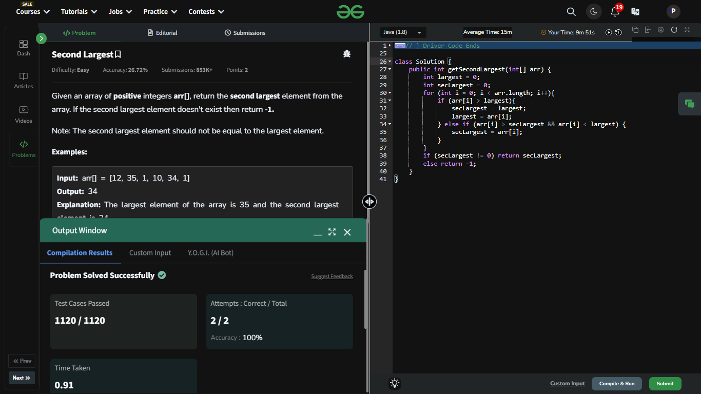

## Day 1: Second Largest  
**Problem**: Find the second largest element in an array.  
**Approach**:  
- Initialize two variables `largest` and `secondLargest` to track the top two largest numbers.  
- Iterate through the array:  
  - Update `largest` if the current element is greater.  
  - Update `secondLargest` if the current element is between `largest` and its previous value.  

**Code**:  
```java
class Solution {
    public int getSecondLargest(int[] arr) {
        int largest = 0;
        int secLargest = 0;
        for (int i = 0; i < arr.length; i++){
            if (arr[i] > largest){
                secLargest = largest;
                largest = arr[i];
            } else if (arr[i] > secLargest && arr[i] < largest) {
                secLargest = arr[i];
            }
        }
        if (secLargest != 0) return secLargest;
        else return -1;
    }
}
```


