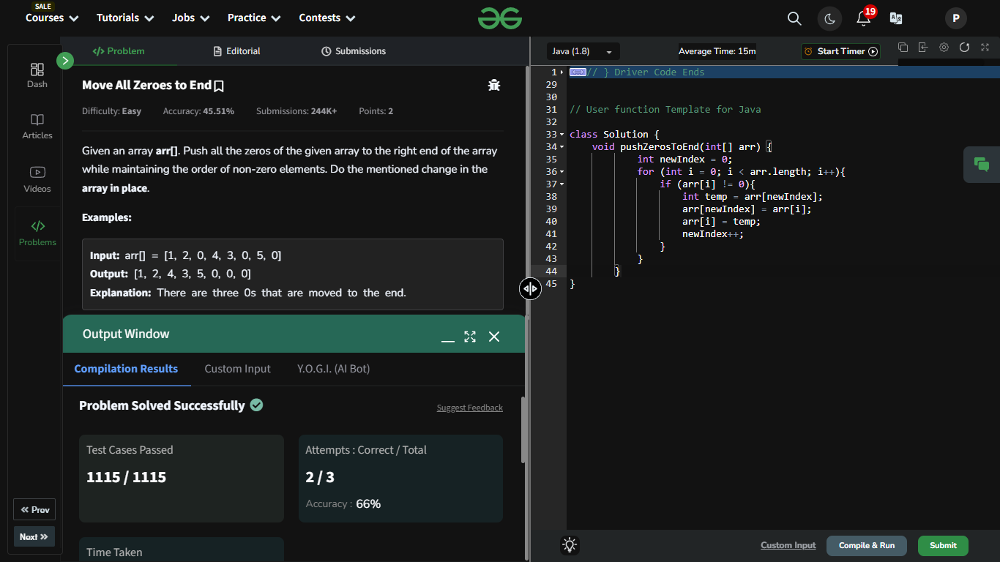

## Day 2: Move All Zeroes to End

**Problem**: Given an array arr[]. Push all the zeros of the given array to the right end of the array while maintaining the order of non-zero elements.  
**Approach**:
1. Use a pointer (newIndex) to track the position where the next non-zero element should go.
2. Traverse the array.
   - If you find a non-zero element, swap it with the element at newIndex.
   - Move the pointer (newIndex) forward after the swap.
3. By the end of the loop, all non-zero elements are at the front, and zeros are at the end.

**Code**:
```java
class Solution {
    void pushZerosToEnd(int[] arr) {
            int newIndex = 0;
            for (int i = 0; i < arr.length; i++){
                if (arr[i] != 0){
                    int temp = arr[newIndex];
                    arr[newIndex] = arr[i];
                    arr[i] = temp;
                    newIndex++;
                }
            }
        }
}   
```

