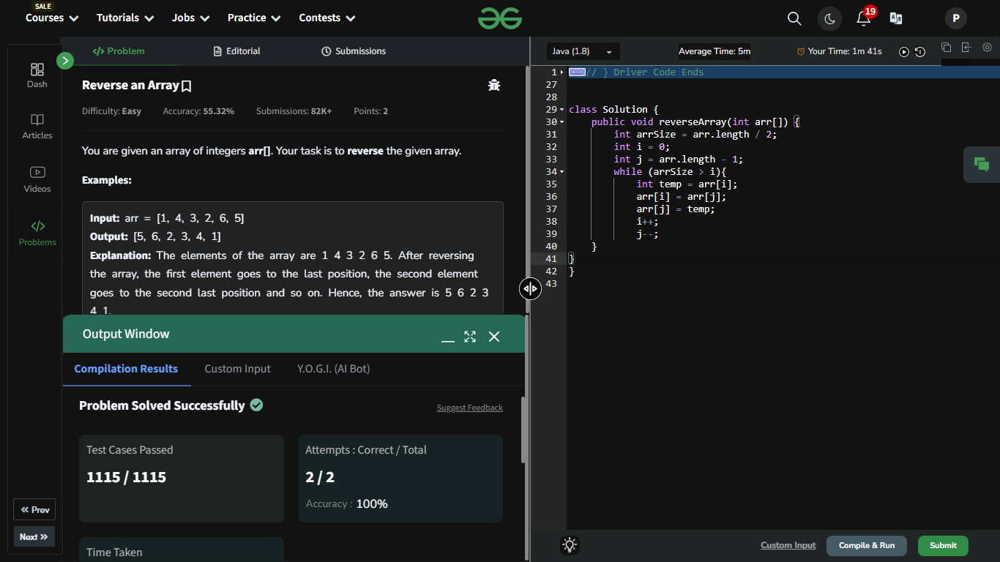

## Day 3: Reverse an Array

**Problem**: You are given an array of integers arr[]. The task is to reverse the given array.  
**Approach**: 
- It is a Simple Approach: 
  - Use two pointers: one starting at the beginning of the array (i) and the other at the end (j).
  - Swap the elements at the two pointers.
  - Increment the starting pointer (i) and decrement the ending pointer (j).
  - Repeat the process until the pointers meet or cross in the middle of the array.  

**Code**:
```java
class Solution {
    public void reverseArray(int arr[]) {
        int arrSize = arr.length / 2;
        int i = 0;
        int j = arr.length - 1;
        while (arrSize > i){
            int temp = arr[i];
            arr[i] = arr[j];
            arr[j] = temp;
            i++;
            j--;
    }
}
}
```


