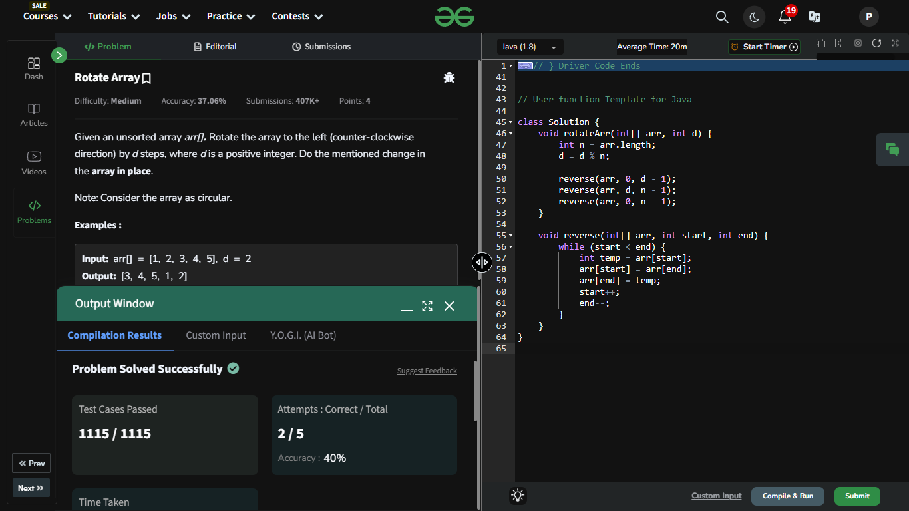

## Day 4: Rotate Array

**Problem**: Given an unsorted array arr[]. Rotate the array to the left (counter-clockwise direction) by d steps, where d is a positive integer.  
**Approach**: 
1. Understand Rotation: Rotating left means each element shifts to the left by d positions, and the first d elements wrap around to the end of the array.
2. Use Reversals: Instead of physically shifting elements (which is inefficient), we reverse sections of the array:
   - Reverse the first d elements so they are in their final positions but reversed.
   - Reverse the remaining n-d elements so they too are reversed in their group.
   - Finally, reverse the entire array to combine both parts correctly. 
   - This method is efficient (O(n)) and uses constant extra space. 

**Code**:
```java

class Solution {
    void rotateArr(int[] arr, int d) {
        int n = arr.length;
        d = d % n;
        
        reverse(arr, 0, d - 1);
        reverse(arr, d, n - 1); 
        reverse(arr, 0, n - 1); 
    }

    void reverse(int[] arr, int start, int end) {
        while (start < end) {
            int temp = arr[start];
            arr[start] = arr[end];
            arr[end] = temp;
            start++;
            end--;
        }
    }
}

```


