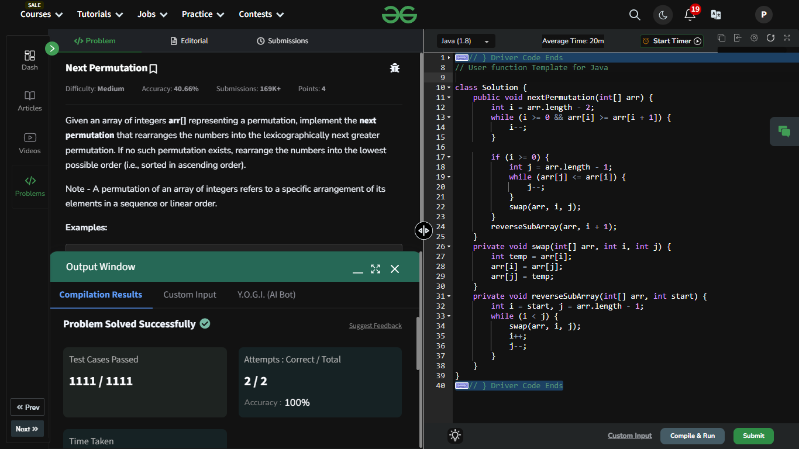

## Day 5: Next Permutation

**Problem**: Given an array of integers arr[] representing a permutation, implement the next permutation that rearranges the numbers into the lexicographically next greater permutation. If no such permutation exists, rearrange the numbers into the lowest possible order (i.e., sorted in ascending order).  
**Approach**:
  - Find the Pivot: Traverse from right to left to find the first number (arr[i]) that is smaller than the number immediately after it (arr[i+1]). This identifies the point where the sequence stops decreasing and can still produce the next greater permutation.
  - Find the Swap Element: From the right side, locate the smallest number that is greater than arr[i]. This ensures that the swapped number will produce the next permutation in lexicographical order.
  - Swap the Numbers: Swap arr[i] with the number found in step 2.
  - Reverse the Subarray: Reverse the subarray starting from i+1 to the end of the array. This ensures the smallest possible order for the numbers after the swapped position.  

**Code**:
```java
import java.util.Arrays;
class NextPermutation {
    public void nextPermutation(int[] arr) {
        int i = arr.length - 2;
        while (i >= 0 && arr[i] >= arr[i + 1]) {
            i--;
        }

        if (i >= 0) {
            int j = arr.length - 1;
            while (arr[j] <= arr[i]) {
                j--;
            }
            swap(arr, i, j);
        }
        reverseSubArray(arr, i + 1);
    }
    private void swap(int[] arr, int i, int j) {
        int temp = arr[i];
        arr[i] = arr[j];
        arr[j] = temp;
    }
    private void reverseSubArray(int[] arr, int start) {
        int i = start, j = arr.length - 1;
        while (i < j) {
            swap(arr, i, j);
            i++;
            j--;
        }
    }
}
public class Problem5 {
    public static void main(String[] args) {
        int[] array = {2, 4, 1, 7, 5, 0};
        NextPermutation box = new NextPermutation();
        box.nextPermutation(array);
        System.out.println(Arrays.toString(array));
    }
}
```



