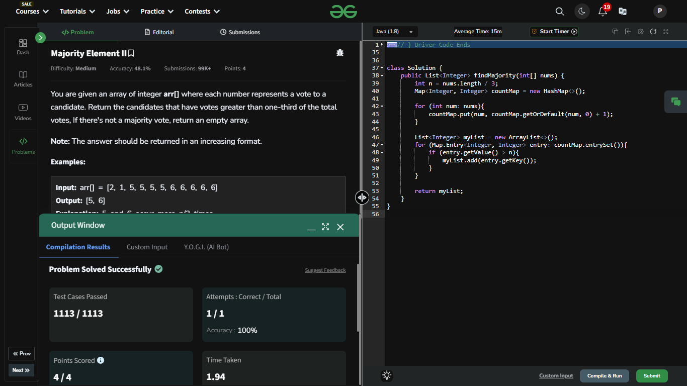

## Day 6: Majority Element II

**Problem**:You are given an array of integer arr[] where each number represents a vote to a candidate. Return the candidates that have votes greater than one-third of the total votes, If there's not a majority vote, return an empty array.  
**Approach**:
  - Use a map to count how many times each number appears.
  - Traverse the array and for each number, increase its count in the map.
  - After counting, go through the map to check which numbers have counts greater than n/3.
  - Add those numbers to a result list.

**Code**:
```java
import java.util.ArrayList;
import java.util.HashMap;
import java.util.List;
import java.util.Map;

class Solution6 {
    public List<Integer> findMajority(int[] nums) {
        int n = nums.length / 3;
        Map<Integer, Integer> countMap = new HashMap<>();
        for (int num: nums){
            countMap.put(num, countMap.getOrDefault(num, 0) + 1);
            //This is where we are storing in a map key(i.e. Number) and its value(i.e. Times it appeared)
        }
        List<Integer> myList = new ArrayList<>();
        for (Map.Entry<Integer, Integer> entry: countMap.entrySet()){
            if (entry.getValue() > n){
                myList.add(entry.getKey());
            }
        }
        return myList;
    }
}

public class problem6 {
    public static void main(String[] args) {
        int[] array = {1, 2, 3, 4, 5};
        Solution6 box = new Solution6();
        System.out.println(box.findMajority(array));
    }
}

```

