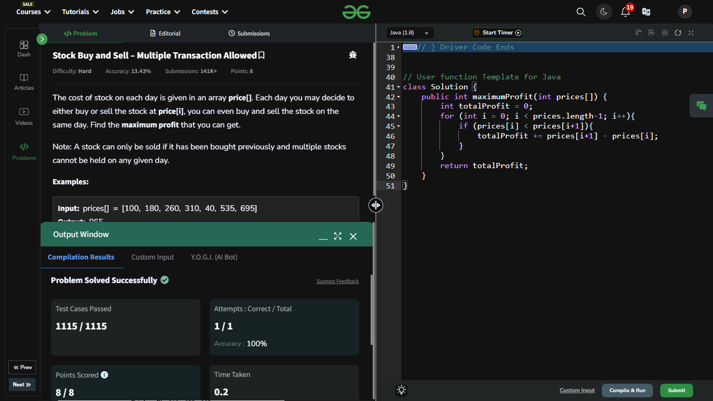

## Day 7: Stock Buy and Sell – Multiple Transaction Allowed

**Problem**: The cost of stock on each day is given in an array price[]. Each day you may decide to either buy or sell the stock at price[i], you can even buy and sell the stock on the same day. Find the maximum profit that you can get.
  
**Approach**:
  - Traverse the array of stock prices.
  - For each day, check if the next day's price (price[i+1]) is higher than the current day's price (price[i]).
  - If yes, calculate the profit (price[i+1] - price[i]) and add it to the total profit.
  - Continue until the end of the array.
  

**Code**:
```java
package dsa_codes;

class Solution7 {
    public int maximumProfit(int[] prices) {
        int totalProfit = 0;
        for (int i = 0; i < prices.length-1; i++){
            if (prices[i] < prices[i+1]){
                totalProfit += prices[i+1] - prices[i];
            }
        }
        return totalProfit;
    }
}

public class Problem7 {
    public static void main(String[] args) {
        int[] array = {100, 180, 260, 310, 40, 535, 695};
        Solution7 box = new Solution7();
        System.out.println(box.maximumProfit(array));
    }
}

```


