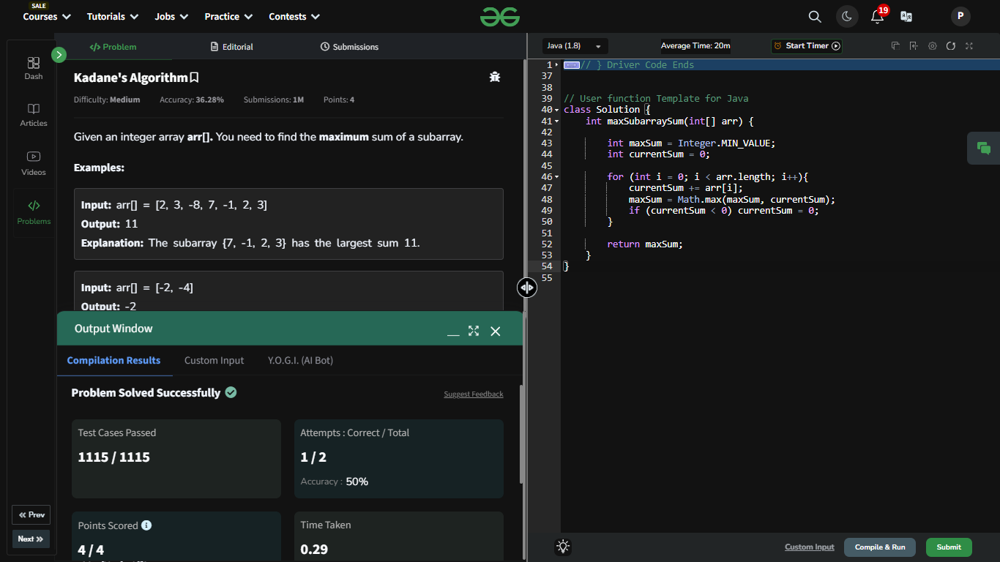

## Day 10: Kadane's Algorithm

**Problem**: Given an integer array arr[]. You need to find the maximum sum of a subarray.

**Approach**: 
1. Initialize: Set maxSum to the smallest integer and currentSum to 0.
2. Iterate: For each element in the array:
    - Add it to currentSum.
    - Update maxSum with the higher value between maxSum and currentSum.
    - Reset currentSum to 0 if it becomes negative.
3. Return: maxSum, which holds the maximum sum of a subarray.

**Code**:
```java

class Solution10 {
    int maxSubArraySum(int[] arr) {
        int maxSum = Integer.MIN_VALUE;
        int currentSum = 0;

        for (int i = 0; i < arr.length; i++){
            currentSum += arr[i];
            maxSum = Math.max(maxSum, currentSum);
            if (currentSum < 0) currentSum = 0;
        }

        return maxSum;
    }
}

public class Problem10 {
    public static void main(String[] args) {
        int[] array = {-2, -4};
        Solution10 box = new Solution10();
        System.out.println(box.maxSubArraySum(array));
    }
}
```

