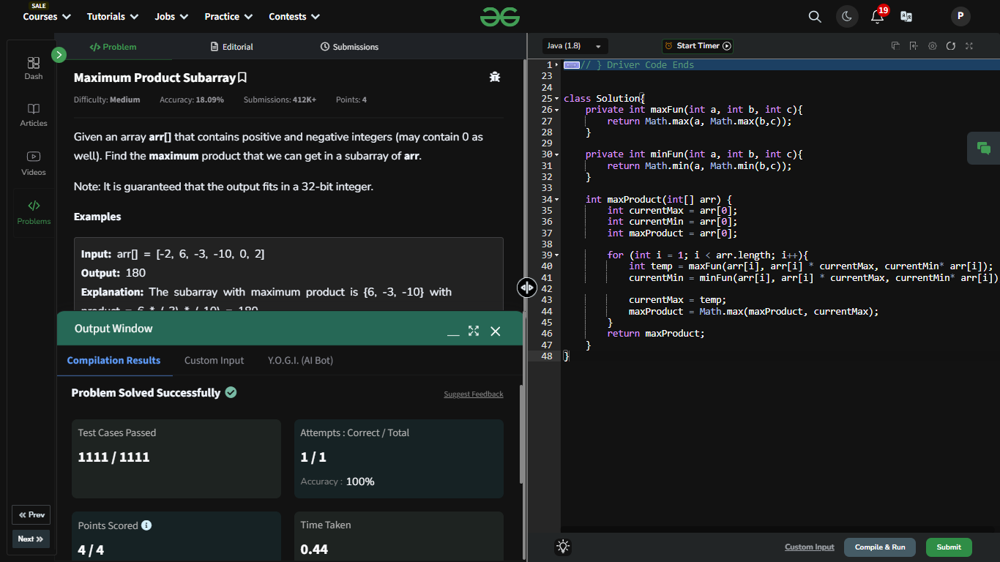

## Day 11: Maximum Product Subarray

**Problem**: Given an array arr[] that contains positive and negative integers (may contain 0 as well). Find the maximum product that we can get in a subarray of arr[].
**Approach**: 
- Logic:
  1. Use two variables, currentMax and currentMin, to track the max and min products at each step (important for handling negatives).
  2. For each element, compute:
    - Maximum of the element itself, the product with currentMax, and the product with currentMin.
    - Similarly, compute the minimum.
  3. Update maxProduct with the largest value of currentMax encountered.
- Result: Return maxProduct as the maximum product of any subarray.

**Code**:
```java
package dsa_codes;

class Solution11{
    private int maxFun(int a, int b, int c){
        return Math.max(a, Math.max(b,c));
    }

    private int minFun(int a, int b, int c){
        return Math.min(a, Math.min(b,c));
    }

    int maxProduct(int[] arr) {
        int currentMax = arr[0];
        int currentMin = arr[0];
        int maxProduct = arr[0];

        for (int i = 1; i < arr.length; i++){
            int temp = maxFun(arr[i], arr[i] * currentMax, currentMin* arr[i]);
            currentMin = minFun(arr[i], arr[i] * currentMax, currentMin* arr[i]);

            currentMax = temp;
            maxProduct = Math.max(maxProduct, currentMax);
        }
        return maxProduct;
    }
}

public class Problem11 {
    public static void main(String[] args) {
        int[] array = {-1, -3, -10, 0, 6};
        Solution11 box = new Solution11();
        System.out.println(box.maxProduct(array));
    }
}
```

