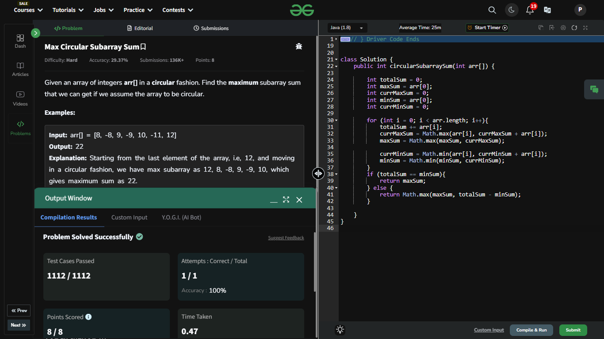

## Day 12: Max Circular Subarray Sum

**Problem**: Given an array of integers arr[] in a circular fashion. Find the maximum subarray sum that we can get if we assume the array to be circular.
**Approach**:
- Calculate the maximum & minimum subarray sum using Kadane's Algorithm.
- Compute the total sum of the array.
- If the array consists of all negative numbers:
  - The max sum is the result from Kadane's Algorithm (normal max subarray sum).
- Otherwise:
  - The result is the maximum of:
    - Max sum from Kadane's.
    - Circular max sum = total sum - minimum subarray sum.

**Code**:
```java

class Solution12 {
    public int circularSubArraySum(int[] arr) {
        int totalSum = 0;
        int maxSum = arr[0];
        int currMaxSum = 0;
        int minSum = arr[0];
        int currMinSum = 0;

        for (int i = 0; i < arr.length; i++){
            totalSum += arr[i];
            currMaxSum = Math.max(arr[i], currMaxSum + arr[i]);
            maxSum = Math.max(maxSum, currMaxSum);

            currMinSum = Math.min(arr[i], currMinSum + arr[i]);
            minSum = Math.min(minSum, currMinSum);
        }
        if (totalSum == minSum){
            return maxSum;
        } else {
            return Math.max(maxSum, totalSum - minSum);
        }

    }
}
public class Problem12 {
    public static void main(String[] args) {
        int[] array = { 10, -3, -4, 7, 6, 5, -4, -1};
        Solution12 box = new Solution12();
        System.out.println(box.circularSubArraySum(array));
    }
}

```

