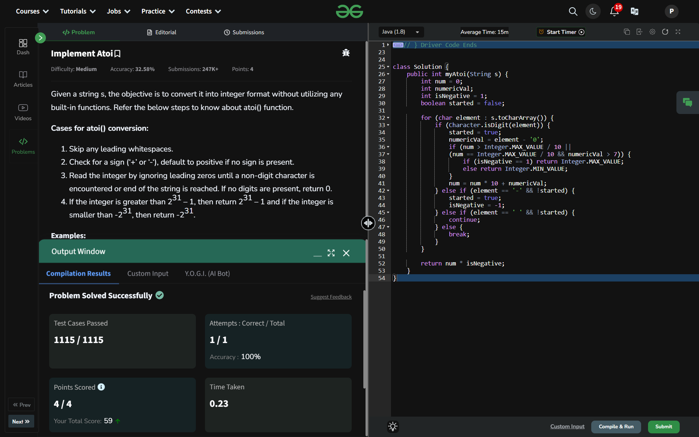

## Day 14: Implement Atoi

**Problem**: Given a string s, the objective is to convert it into integer format without utilizing any built-in functions. Refer the below steps to know about atoi() function.

**Approach**: 
- Skip Leading Spaces: Ignore spaces until conversion starts.
- Check Sign: Handle - or + if found before digits.
- Process Digits: Convert characters to numbers using element - '0'.
- Handle Overflow: Check if adding the digit would exceed Integer.MAX_VALUE or Integer.MIN_VALUE.
- Stop on Invalid Input: Exit the loop on non-digit characters after conversion starts.
- Return Result: Multiply the number by isNegative to account for the sign

**Code**:
```java
package dsa_codes;
class Solution14 {
    public int myAtoi(String s) {
        int num = 0;
        int numericVal;
        int isNegative = 1;
        boolean started = false;

        for (char element : s.toCharArray()) {
            if (Character.isDigit(element)) {
                started = true;
                numericVal = element - '0';
                if (num > Integer.MAX_VALUE / 10 || (num == Integer.MAX_VALUE / 10 && numericVal > 7)) {
                    if (isNegative == 1) return Integer.MAX_VALUE;
                    else return Integer.MIN_VALUE;
                }
                num = num * 10 + numericVal;
            } else if (element == '-' && !started) {
                started = true;
                isNegative = -1;
            } else if (element == ' ' && !started) {
                continue;
            } else {
                break;
            }
        }

        return num * isNegative;
    }
}
    public class Problem14 {
        public static void main(String[] args) {
            String str = "  -0012gfg4";
            Solution14 box = new Solution14();
            System.out.println(box.myAtoi(str));
        }
    }

```

