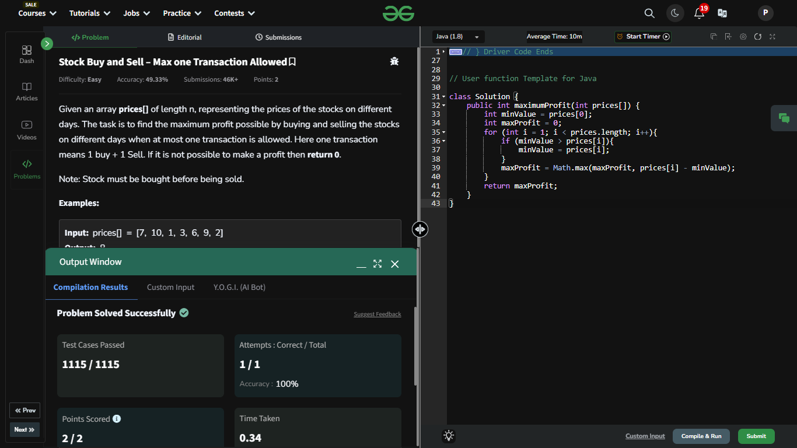

## Day 8: Stock Buy and Sell – Max one Transaction Allowed

**Problem**: Given an array prices[] of length n, representing the prices of the stocks on different days. The task is to find the maximum profit possible by buying and selling the stocks on different days when at most one transaction is allowed. Here one transaction means 1 buy + 1 Sell. If it is not possible to make a profit then return 0.

**Approach**:
  - Keep track of the minimum price (minValue) seen so far.
  - For each price, calculate the profit as prices[i] - minValue.
  - Update the maximum profit (maxProfit) if the calculated profit is greater.
  - Return maxProfit. If no profit is possible, it remains 0.

    - Time Complexity: 𝑂(𝑛)
    - Space Complexity: 𝑂(1)


**Code**:
```java
class Solution8 {
    public int maximumProfit(int prices[]) {
        int minValue = prices[0];
        int maxProfit = 0;
        for (int i = 1; i < prices.length; i++){
            if (minValue > prices[i]){
                minValue = prices[i];
            }
            maxProfit = Math.max(maxProfit, prices[i] - minValue);
        }
        return maxProfit;
    }
}

public class Problem8 {
    public static void main(String[] args) {
        int[] array = {7, 10, 1, 3, 6, 9, 2};
        Solution8 box = new Solution8();
        System.out.println(box.maximumProfit(array));
    }
}


```

