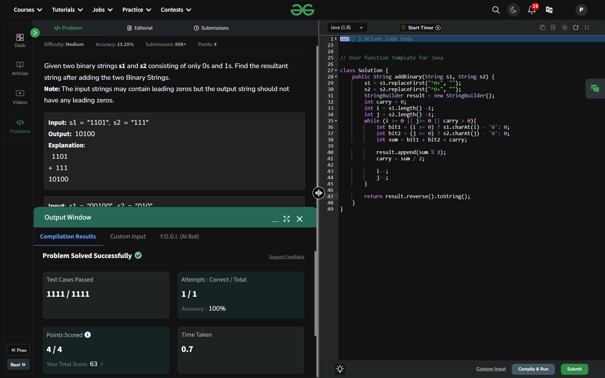

## Day 15: Add Binary Strings

**Problem**: Given two binary strings s1 and s2 consisting of only 0s and 1s. Find the resultant string after adding the two Binary Strings.

**Approach**:
- Remove Leading Zeros: Use replaceFirst("^0+", "") to trim leading zeros from both strings.
- Initialize Variables: Set up a StringBuilder for the result, a carry variable, and pointers starting at the ends of the strings.
- Iterate and Add Bits: Loop while pointers or carry exist. Add corresponding bits from both strings and the carry. Append the remainder of the sum (sum % 2) to the result and update carry as sum / 2.
- Handle Remaining Bits: Continue adding bits and carry until all are processed.
- Reverse Result: Reverse the StringBuilder to get the final binary sum and return it

**Code**:
```java
package dsa_codes;

class Solution15 {
    public String addBinary(String s1, String s2) {
        s1 = s1.replaceFirst("^0+", "");
        s2 = s2.replaceFirst("^0+", "");
        StringBuilder result = new StringBuilder();
        int carry = 0;
        int i = s1.length() -1;
        int j = s2.length() -1;
        while (i >= 0 || j>= 0 || carry > 0){
            int bit1 = (i >= 0) ? s1.charAt(i) - '0': 0;
            int bit2 = (j >= 0) ? s2.charAt(j) - '0': 0;
            int sum = bit1 + bit2 + carry;

            result.append(sum % 2);
            carry = sum / 2;

            i--;
            j--;
        }

        return result.reverse().toString();
    }
}

public class Problem15 {
    public static void main(String[] args) {
        String s1 = "00100";
        String s2 = "010";
        Solution15 box = new Solution15();
        System.out.println(box.addBinary(s1, s2));
    }
}

```

