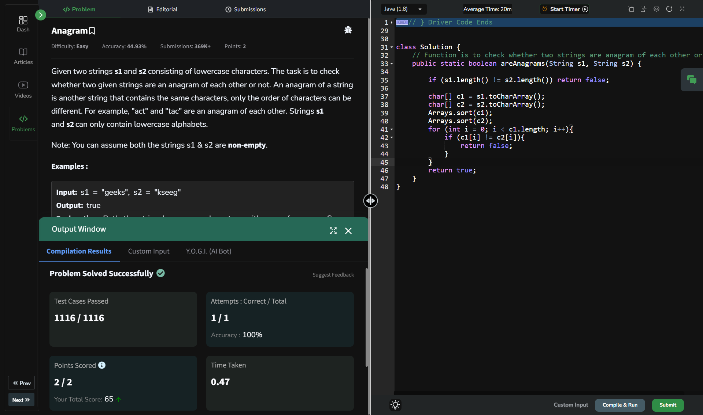

## Day 16: Anagram

**Problem**: Given two strings s1 and s2 consisting of lowercase characters. The task is to check whether two given strings are an anagram of each other or not. An anagram of a string is another string that contains the same characters, only the order of characters can be different. For example, "act" and "tac" are an anagram of each other. Strings s1 and s2 can only contain lowercase alphabets.

**Approach**: 
- Convert both strings to character arrays.
- Sort both arrays.
- Compare the sorted arrays character by character.
- If all characters match, return true; otherwise, return false.

**Code**:
```java
import java.util.Arrays;

class Solution16 {
    public boolean areAnagrams(String s1, String s2) {
        if (s1.length() != s2.length()) return false;

        char[] c1 = s1.toCharArray();
        char[] c2 = s2.toCharArray();
        Arrays.sort(c1);
        Arrays.sort(c2);
        for (int i = 0; i < c1.length; i++){
            if (c1[i] != c2[i]){
                return false;
            }
        }
        return true;
    }
}

public class Problem16 {
    public static void main(String[] args) {
        String s1 = "g";
        String s2 = "g";
        Solution16 box = new Solution16();
        System.out.println(box.areAnagrams(s1, s2));
    }
}

```


