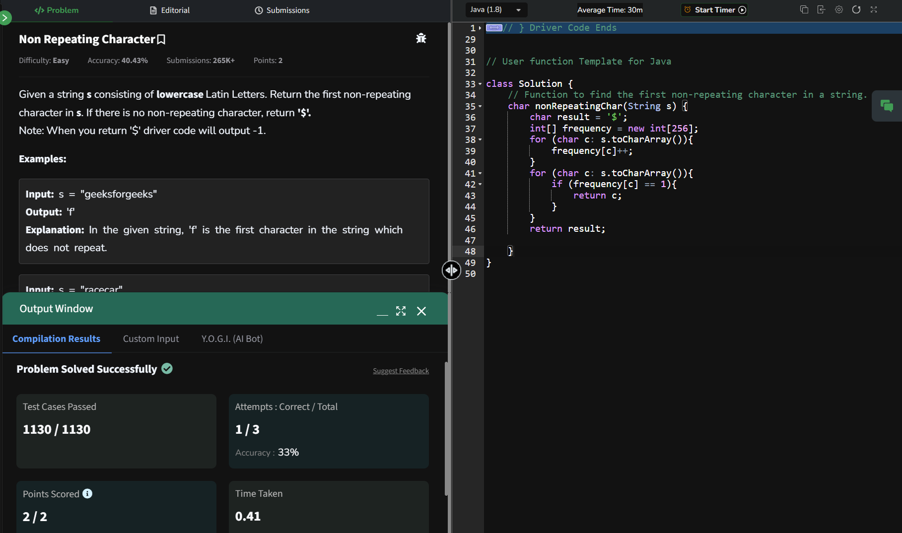

## Day 17: Non Repeating Character

**Problem**:Given a string s consisting of lowercase Latin Letters. Return the first non-repeating character in s. If there is no non-repeating character, return '$'.

**Approach**: 
- Use an array frequency to count the occurrences of each character in the string. The size of the array is 256 to cover all possible ASCII characters.
- Iterate through the string once to populate the frequency array with the count of each character.
- Iterate through the string again to find the first character with a frequency of 1.
- If such a character is found, return it; otherwise, return '$'.

**Code**:
```java

class Solution17 {
    char nonRepeatingChar(String s) {
        char result = '$';
        int[] frequency = new int[256];
        for (char c: s.toCharArray()){
            frequency[c]++;
        }
        for (char c: s.toCharArray()){
            if (frequency[c] == 1){
                return c;
            }
        }
        return result;

    }
}

public class Problem17 {
    public static void main(String[] args) {
        String string = "geeksforgeeks";
        Solution17 box = new Solution17();
        System.out.println(box.nonRepeatingChar(string));
    }
}

```

