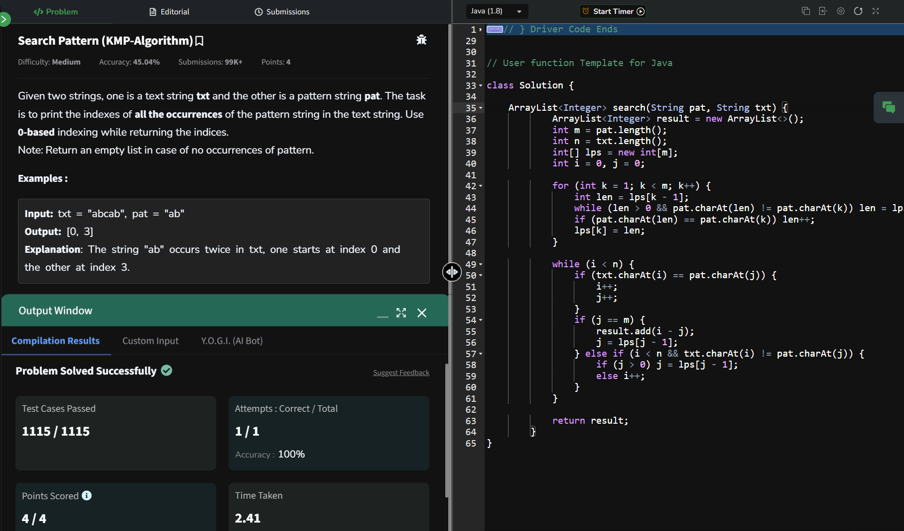

## Day 18: Search Pattern (KMP-Algorithm)

**Problem**: Given two strings, one is a text string txt and the other is a pattern string pat. The task is to print the indexes of all the occurrences of the pattern string in the text string. Use 0-based indexing while returning the indices. 

**Approach**:
1. LPS Array:
  - Precompute the Longest Prefix Suffix (LPS) array for the pattern.
  - This helps skip unnecessary comparisons during pattern matching.

2. Pattern Matching:
  - Use two pointers, i for text and j for the pattern.
  - If characters match, increment both i and j.
  - If j equals the length of the pattern, store the start index (i - j) in the result list.
  - On mismatch:
    - If j > 0, update j using lps[j-1].
    - Else, increment i.

**Code**:
```java
import java.util.ArrayList;

class Solution18 {
        ArrayList<Integer> search(String pat, String txt) {
            ArrayList<Integer> result = new ArrayList<>();
            int m = pat.length();
            int n = txt.length();
            int[] lps = new int[m];
            int i = 0, j = 0;

            for (int k = 1; k < m; k++) {
                int len = lps[k - 1];
                while (len > 0 && pat.charAt(len) != pat.charAt(k)) len = lps[len - 1];
                if (pat.charAt(len) == pat.charAt(k)) len++;
                lps[k] = len;
            }

            while (i < n) {
                if (txt.charAt(i) == pat.charAt(j)) {
                    i++;
                    j++;
                }
                if (j == m) {
                    result.add(i - j);
                    j = lps[j - 1];
                } else if (i < n && txt.charAt(i) != pat.charAt(j)) {
                    if (j > 0) j = lps[j - 1];
                    else i++;
                }
            }

            return result;
        }
}

public class Problem18 {
    public static void main(String[] args) {
        Solution18 solution= new Solution18();
        String txt = "aabaacaadaabaaba";
        String pat = "aaba";
        System.out.println(solution.search(pat, txt));
    }
}
```

