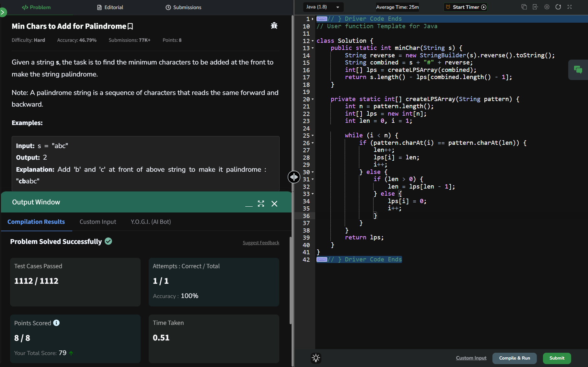

## Day 19: Min Chars to Add for Palindrome

**Problem**: Given a string s, the task is to find the minimum characters to be added at the front to make the string palindrome.
**Approach**:
- Reverse the string s to get revS.
- Create a new string: combined = s + "#" + revS.
- Build the LPS array for this combined string. The LPS helps us find the longest prefix of s that is also a suffix of revS.
- The last value of the LPS array gives the length of this matching prefix-suffix.
- Subtract this value from the length of s. The result is the minimum number of characters to add at the front.

**Code**:
```java

class Solution19 {
    public static int minChar(String s) {
        String reverse = new StringBuilder(s).reverse().toString();
        String combined = s + "#" + reverse;
        int[] lps = createLPSArray(combined);
        return s.length() - lps[combined.length() - 1];
    }

    private static int[] createLPSArray(String pattern) {
        int n = pattern.length();
        int[] lps = new int[n];
        int len = 0, i = 1;

        while (i < n) {
            if (pattern.charAt(i) == pattern.charAt(len)) {
                len++;
                lps[i] = len;
                i++;
            } else {
                if (len > 0) {
                    len = lps[len - 1];
                } else {
                    lps[i] = 0;
                    i++;
                }
            }
        }
        return lps;
    }
}

public class Problem19 {
    public static void main(String[] args) {
        String s = "aacecaaaa";
        System.out.println(Solution19.minChar(s));
    }
}

```

