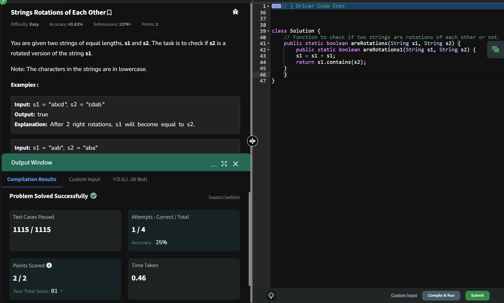

## Day 20: Strings Rotations of Each Other

**Problem**:You are given two strings of equal lengths, s1 and s2. The task is to check if s2 is a rotated version of the string s1.

**Approach**: 
1. Check Lengths:
    - If the lengths of s1 and s2 are not equal, return false directly.
2. Concatenate s1 with Itself:
    - Create a new string combined by concatenating s1 with itself: combined = s1 + s1.
3. Check Substring:
    - Use the contains method to check if s2 is a substring of combined. If s2 is found, return true. Otherwise, return false.

**Code**:
```java
class Solution20 {
    public static boolean areRotations1(String s1, String s2) {
        s1 = s1 + s1;
        return s1.contains(s2);
    }
}

public class Problem20 {
    public static void main(String[] args) {
        String s1 = "abcd";
        String s2 = "cdab";
        System.out.println(Solution20.areRotations(s1, s2));
    }
}
```

