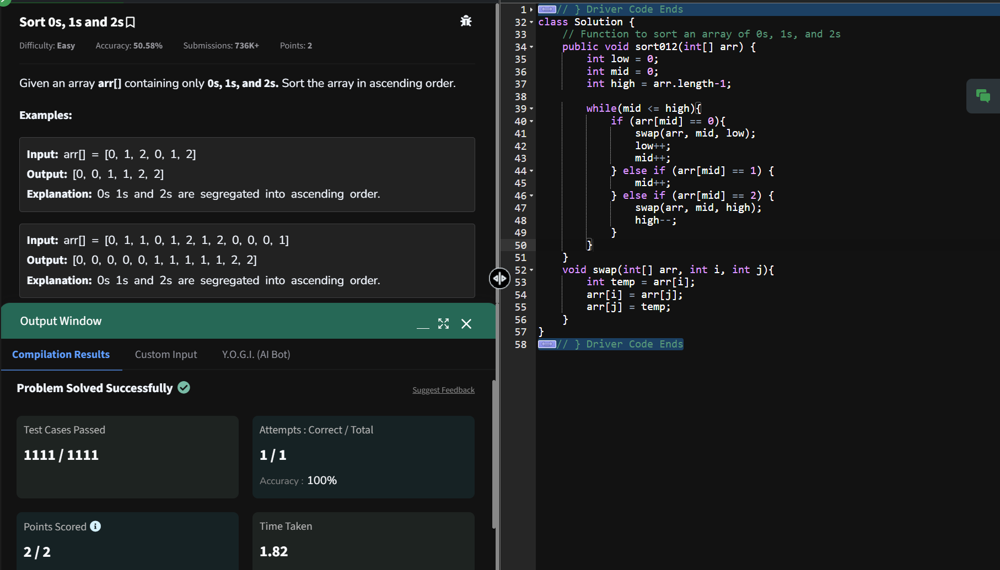

## Day 21: Sort 0s, 1s and 2s

**Problem**: Given an array arr[] containing only 0s, 1s, and 2s. Sort the array in ascending order.

**Approach**: 
1. Initialize Pointers:
  - low points to the beginning of the array.
  - mid traverses the array.
  - high points to the end of the array.

2. Process the Array:
  - Iterate with mid until it surpasses high.
  - Swap values based on the category of arr[mid]:
      - Case 0: Swap arr[low] with arr[mid], increment both low and mid.
      - Case 1: Simply increment mid.
      - Case 2: Swap arr[mid] with arr[high] and decrement high.

3. End Condition:
  - The array is sorted into three sections by the end of the traversal.

**Code**:
```java

import java.util.Arrays;

class Solution21 {
    public void sort012(int[] arr) {
        int low = 0;
        int mid = 0;
        int high = arr.length-1;

        while(mid <= high){
            if (arr[mid] == 0){
                swap(arr, mid, low);
                low++;
                mid++;
            } else if (arr[mid] == 1) {
                mid++;
            } else if (arr[mid] == 2) {
                swap(arr, mid, high);
                high--;
            }
        }
    }
    void swap(int[] arr, int i, int j){
        int temp = arr[i];
        arr[i] = arr[j];
        arr[j] = temp;
    }
}

public class Problem21 {
    public static void main(String[] args) {
        int[] array = {0,1,2,0,1,2};
        Solution21 box = new Solution21();
        box.sort012(array);
        System.out.println("Final Array: " + Arrays.toString(array));
    }
}

```

