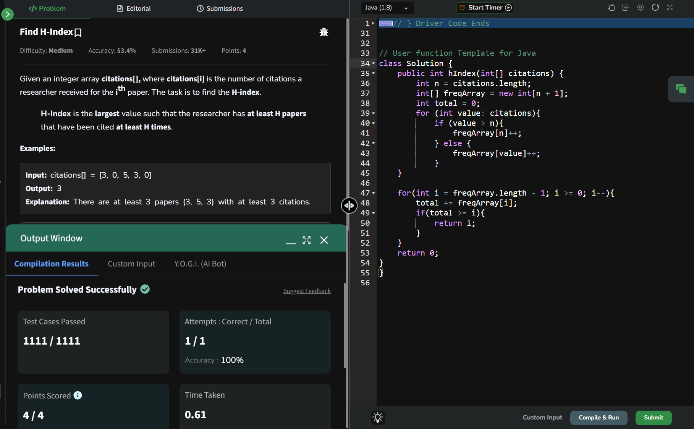

## Day 22: Find H-Index

**Problem**: Given an integer array citations[], where citations[i] is the number of citations a researcher received for the ith paper. The task is to find the H-index. H-Index is the largest value such that the researcher has at least H papers that have been cited at least H times.

**Approach**: 
1. Sort the citations array in descending order.
    - This makes it easier to count how many papers have at least i citations.

2. Iterate through the sorted array:
    - For each paper at index i, check if the number of citations is at least i+1 (because the array is 0-indexed).
    - If it is, keep going. If not, stop and return i, because that’s the highest H where the condition holds.

3. Edge case:
    - If you go through the entire array without stopping, the H-index is the total number of papers. 

**Code**:
```java

class Solution22 {
    public int hIndex(int[] citations) {
        int n = citations.length;
        int[] freqArray = new int[n + 1];
        int total = 0;
        for (int value: citations){
            if (value > n){
                freqArray[n]++;
            } else {
                freqArray[value]++;
            }
        }

        for (int i = freqArray.length -1; i >= 0; i--){
            total += freqArray[i];
            if (total >= i){
                return i;
            }
        }
        return 0;
    }
}

public class Problem22 {
    public static void main(String[] args) {
        int[] array = {5, 1, 2, 4, 1};
        Solution22 box = new Solution22();
        System.out.println(box.hIndex(array));
    }
}

```

