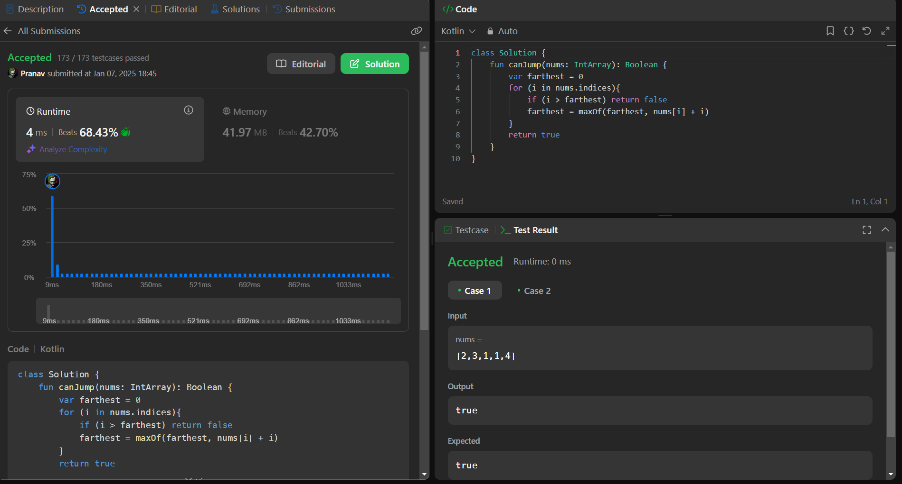

## Day 24: Jump Game

**Problem**: You are given an integer array nums. You are initially positioned at the array's first index, and each element in the array represents your maximum jump length at that position.
                       Return true if you can reach the last index, or false otherwise.

**Approach**: 
1. Used Greedy Algorithm to track the farthest position you can reach.
2. Initialize farthest to 0, which represents the maximum index you can jump to.
    - Traverse the array. For each index i:
    - If i > farthest, it means you cannot reach this index, so return false.
Otherwise, update farthest = max(farthest, nums[i] + i) to extend your reach.
3. If you finish the loop, it means you can reach the last index, so return true.

**Code**:
```java

class Y_DSA24 {
    fun canJump(nums: IntArray): Boolean {
        var farthest = 0
        for (i in nums.indices){
            if (i > farthest) return false
            farthest = maxOf(farthest, nums[i] + i)
        }   
        return true
    }
}

fun main() {
    val array = intArrayOf(3,2,2,0,4)
    val box = Y_DSA24()
    println(box.canJump(array))
}

```

