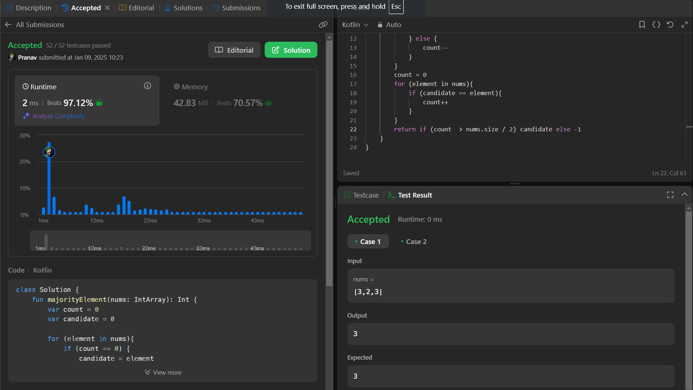

## Day 25: Problem Title

**Problem**: Given an array nums of size n, return the majority element.
                 The majority element is the element that appears more than ⌊n / 2⌋ times. You may assume that the majority element always exists in the array. 

**Approach**: 
- Traverse the array while maintaining a candidate and a count.(I Learned about: Boyer-Moore Voting Algorithm)
    - If the count is zero, update the candidate to the current element.
    - Increment the count if the current element matches the candidate, otherwise decrement it.
    - The candidate at the end is the majority element if one exists.

**Code**:
```kotlin
class Y_DSA25 {
    fun majorityElement(nums: IntArray): Int{
        var count = 0
        var candidate = 0

        for (element in nums){
            if (count == 0) {
                candidate = element
            }
            if (element == candidate){
                count++
            } else {
                count--
            }
        }
        count = 0
        for (element in nums){
            if (candidate == element){
                count++
            }
        }
        return if (count  > nums.size / 2) candidate else -1
    }
}

fun main() {
    val array = intArrayOf(2,2,1,1,1,2,2)
    val box = Y_DSA25()
    println(box.majorityElement(array))
}
```

