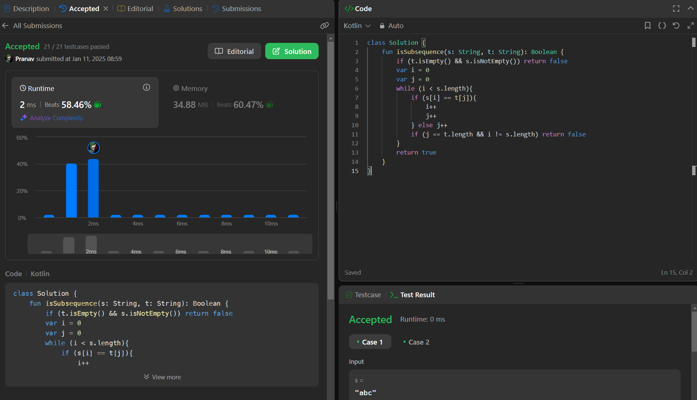

## Day 27: Is Subsequence

**Problem**: Given two strings s and t, return true if s is a subsequence of t, or false otherwise.

**Approach**:
  - i points to the string s and j points to t.
  - Compare characters at s[i] and t[j].
  - If they match, move both pointers forward; otherwise, move j only.
  - If you reach the end of s, return true (all characters in s are matched).
  - If j reaches the end of t before s is fully matched, return false.

**Code**:
```kotlin
class Y_DSA27 {
    fun isSubsequence(s: String, t: String): Boolean {
        var i = 0
        var j = 0
        if (t.isEmpty() && s.isNotEmpty()) return false
        while (i < s.length){
            if (s[i] == t[j]){
                i++
                j++
            } else j++
            if (j == t.length && i != s.length) return false
        }
        return true
    }
}

fun main() {
    val s = "abd"
    val t = "jacbdo"
    val box = Y_DSA27()
    println(box.isSubsequence(s,t))
}
```

