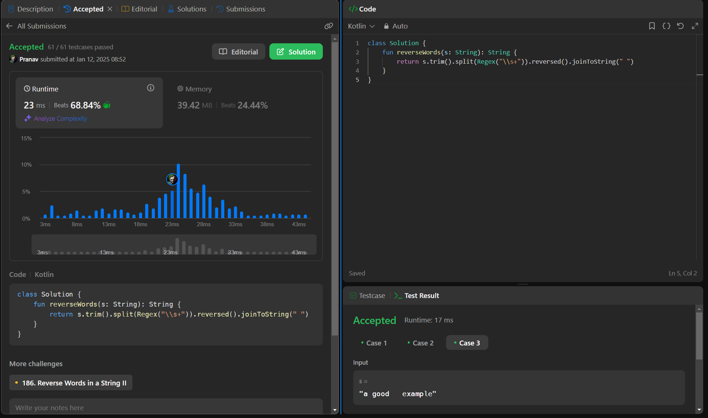

## Day 28: Reverse Words in a String

**Problem**: Given an input string s, reverse the order of the words.
             A word is defined as a sequence of non-space characters. The words in s will be separated by at least one space.
             Return a string of the words in reverse order concatenated by a single space.

**Approach**: 
  - Trim the string to remove leading/trailing spaces.
  - Split the string into words using Regex("\\s+") to handle multiple spaces.
  - Reverse the list of words.
  - Join the reversed words with a single space.

**Code**:
```kotlin
class Y_DSA28 {
    fun reverseWords(s: String): String {
        return s.trim().split(Regex("\\s+")).reversed().joinToString(" ")
    }
}

fun main() {
    val box = Y_DSA28()
    val str = "a good   example"
    println(box.reverseWords(str))
}
```

