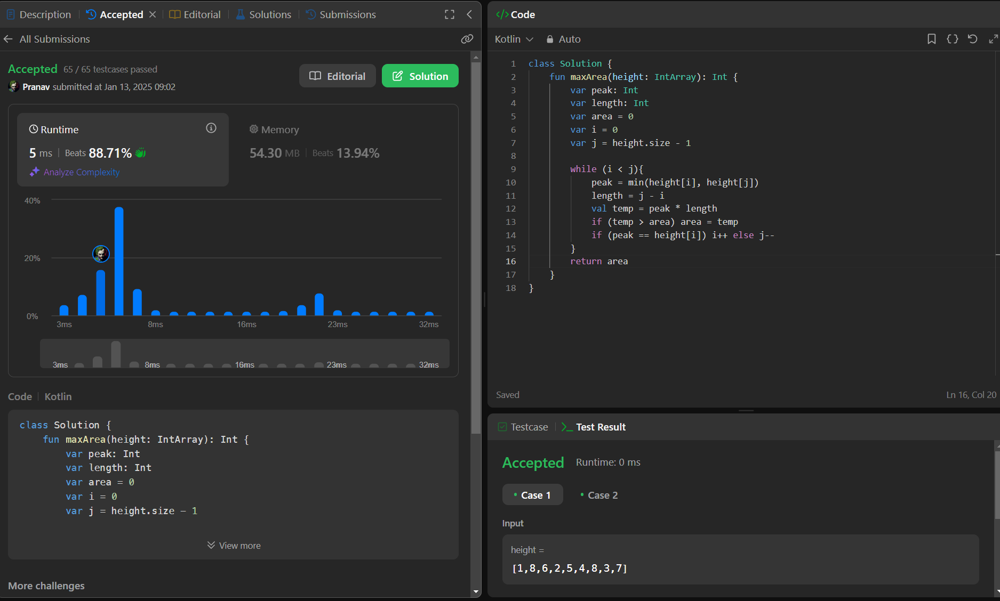

## Day 29: Container With Most Water

**Problem**: You are given an integer array height of length n. There are n vertical lines drawn such that the two endpoints of the ith line are (i, 0) and (i, height[i]).
Find two lines that together with the x-axis form a container, such that the container contains the most water.
Return the maximum amount of water a container can store.Describe the problem briefly.  

**Approach**: 
  - Use two pointers, one at the start and one at the end of the height array.
  - Calculate the area formed by the two pointers: min(height[i], height[j]) * (j - i).
  - Update the maximum area if the current area is larger.
  - Move the pointer pointing to the shorter height inward, as increasing height might increase the area.
  - Repeat until the pointers meet.

**Code**:
```kotlin
class Y_DSA29 {
    fun maxArea(height: IntArray): Int {
        var peak: Int
        var length: Int
        var area = 0
        var i = 0
        var j = height.size - 1

        while (i < j){
            peak = min(height[i], height[j])
            length = j - i
            val temp = peak * length
            if (temp > area) area = temp
            if (peak == height[i]) i++ else j--
        }
        return area
    }
}

fun main() {
    val array = intArrayOf(1,8,6,2,5,4,8,3,7)
    val box = Y_DSA29()
    println(box.maxArea(array))
}
```

