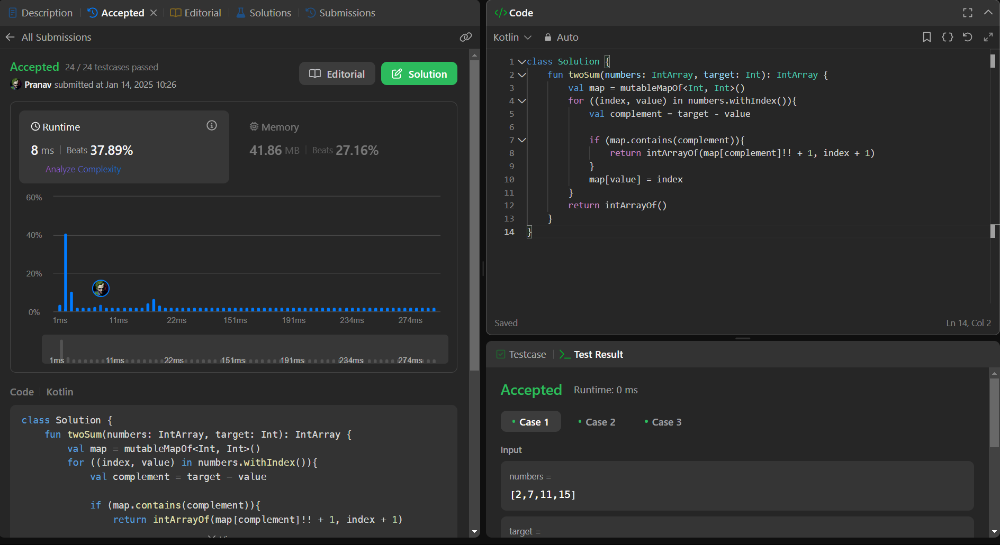

## Day 30:  Two Sum II - Input Array Is Sorted

**Problem**: Given a 1-indexed array of integers numbers that is already sorted in non-decreasing order, find two numbers such that they add up to a specific target number. Let these two numbers be numbers[index1] and numbers[index2] where 1 <= index1 < index2 <= numbers.length.
             Return the indices of the two numbers, index1 and index2, added by one as an integer array [index1, index2] of length 2.
**Approach**:
  - Loop through the array using withIndex() to get both the index and the value.
  - Calculate the complement = target - current number.
  - Check if the complement exists in the hashmap:
      - If yes, return the indices of the current number and its complement.
      - If no, save the current number and its index in the hashmap.
  - If no pair is found by the end of the loop, return an empty array.

**Code**:
```kotlin
class Y_DSA30 {
    fun twoSum(numbers: IntArray, target: Int): IntArray {
        val map = mutableMapOf<Int, Int>()
        for ((index, value) in numbers.withIndex()){
            val complement = target - value

            if (map.contains(complement)){
                return intArrayOf(map[complement]!! + 1, index + 1)
            }
            map[value] = index
        }
        return intArrayOf()
    }
}

fun main() {
    val array = intArrayOf(2,7,11,15)
    val box = Y_DSA30()
    println(box.twoSum(array, 13).joinToString(" ,"))
}
```

