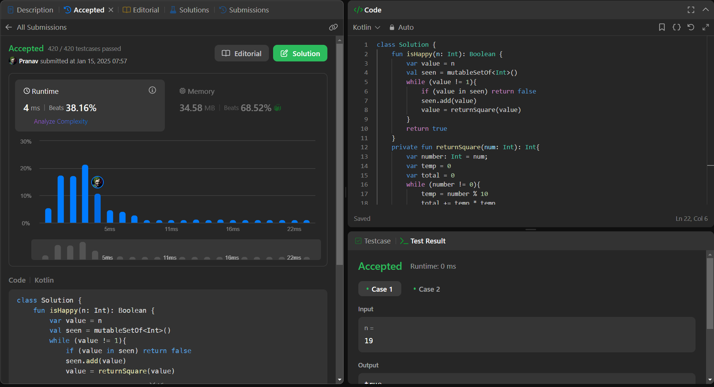

## Day 31: Happy Number

**Problem**: Write an algorithm to determine if a number n is happy.
A happy number is a number defined by the following process:
- Starting with any positive integer, replace the number by the sum of the squares of its digits.
- Repeat the process until the number equals 1 (where it will stay), or it loops endlessly in a cycle which does not include 1.
- Those numbers for which this process ends in 1 are happy.
Return true if n is a happy number, and false if not.

**Approach**: Write about your solution or thought process.

**Code**:
```kotlin
class Y_DSA31 {
    fun isHappy(n: Int): Boolean {
        var value = n
        val seen = mutableSetOf<Int>()
        while (value != 1){
            if (value in seen) return false
            seen.add(value)
            value = returnSquare(value)
        }
        return true
    }
    private fun returnSquare(num: Int): Int{
        var number: Int = num;
        var temp = 0
        var total = 0
        while (number != 0){
            temp = number % 10
            total += temp * temp
            number /= 10
        }
    return total
    }
}

fun main() {
    val box = Y_DSA31()
    println(box.isHappy(2))
    println(box.isHappy(19))
}
```

