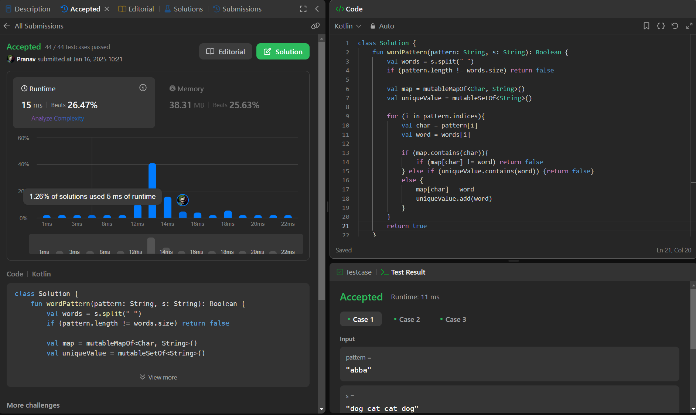

## Day 32: Word Pattern

**Problem**: Given a pattern and a string s, find if s follows the same pattern.
Here follow means a full match, such that there is a bijection between a letter in pattern and a non-empty word in s. Specifically:
- Each letter in pattern maps to exactly one unique word in s.
- Each unique word in s maps to exactly one letter in pattern.
- No two letters map to the same word, and no two words map to the same letter.

**Approach**: 
1. Split the string s into words. If the count of words != pattern length, return false.
2. Use a map to track the mapping of pattern[i] to words[i] and a set to ensure no two pattern[i] map to the same word.
3. Loop through the pattern:
    - If the character is already in the map, ensure the mapped word matches the current word.
    - If not in the map, ensure the current word isn't already mapped to another character, then add it.
4. Return false if any condition fails; otherwise, return true.

**Code**:
```kotlin
class Y_DSA32 {
    fun wordPattern(pattern: String, s: String): Boolean {
        val words = s.split(" ")
        if (pattern.length != words.size) return false

        val map = mutableMapOf<Char, String>()
        val uniqueValue = mutableSetOf<String>()

        for (i in pattern.indices){
            val char = pattern[i]
            val word = words[i]

            if (map.contains(char)){
                if (map[char] != word) return false
            } else if (uniqueValue.contains(word)) {return false}
            else {
                map[char] = word
                uniqueValue.add(word)
            }
        }
        return true
    }
}

fun main() {
    val pattern = "abba"
    val str = "dog dog dog dog"
    val box = Y_DSA32()
    println(box.wordPattern(pattern, str))
}
```

