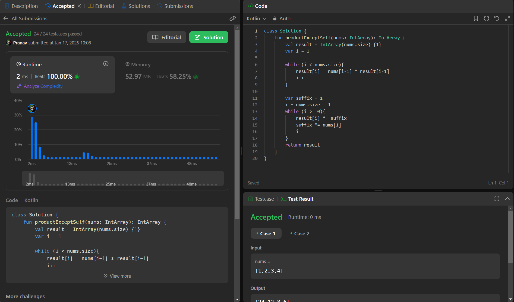

## Day 33: Product of Array Except Self

**Problem**: Given an integer array nums, return an array answer such that answer[i] is equal to the product of all the elements of nums except nums[i].
The product of any prefix or suffix of nums is guaranteed to fit in a 32-bit integer.
You must write an algorithm that runs in O(n) time and without using the division operation.

**Approach**: 
1. Initialize a result array with 1s.
2. First pass (left to right):
    - Calculate the prefix product for each element and store it in result.
3. Second pass (right to left):
    - Use a variable suffix to calculate the suffix product on the fly.
    - Multiply the suffix with result[i] (which already contains the prefix product).
4. Return the result array.

**Code**:
```kotlin
class Y_DSA33_2ndApproach {
    fun productExceptSelf(nums: IntArray): IntArray {
        val result = IntArray(nums.size) {1}
        var i = 1

        while (i < nums.size){
            result[i] = nums[i-1] * result[i-1]
            i++
        }

        var suffix = 1
        i = nums.size - 1
        while (i >= 0){
            result[i] *= suffix
            suffix *= nums[i]
            i--
        }
        return result
    }
}

fun main() {
                        //(1,1,2,6)
    val array = intArrayOf(-1,1,0,-3,3)      //Final : (24,12,8,6)
                       //(24,12,4,1)
    val box = Y_DSA33()
    println(box.productExceptSelf(array).joinToString(", "))
}
```

