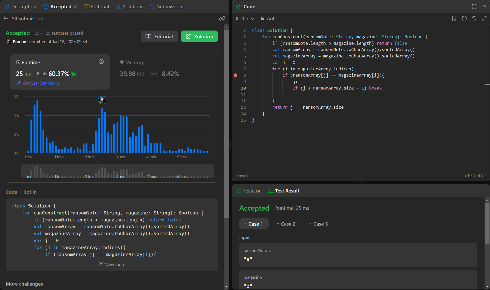

## Day 34: Ransom Note

**Problem**: Given two strings ransomNote and magazine, return true if ransomNote can be constructed by using the letters from magazine and false otherwise.
Each letter in magazine can only be used once in ransomNote.

**Approach**: 
1. If ransomNote length is greater than magazine, return false.
2. Convert both strings to character arrays and sort them.
3. Use two pointers (i for magazine and j for ransomNote).
4. Traverse magazine. If the current magazine character matches the current ransomNote character, move both pointers.
5. If all characters in ransomNote are matched (j == ransomNote.length), return true. Otherwise, return false.

**Code**:
```kotlin
class Y_DSA34 {
    fun canConstruct(ransomNote: String, magazine: String): Boolean {
        if (ransomNote.length > magazine.length) return false
        val ransomArray = ransomNote.toCharArray().sortedArray()
        val magazineArray = magazine.toCharArray().sortedArray()
        var j = 0
        for (i in magazineArray.indices){
            if (ransomArray[j] == magazineArray[i]){
                j++
                if (j > ransomArray.size - 1) break
            }

        }
        return j == ransomArray.size
    }
}

fun main() {
    val note = "aa"
    val magazine = "aab"
    val box = Y_DSA34()
    println(box.canConstruct(note, magazine))
}
```

