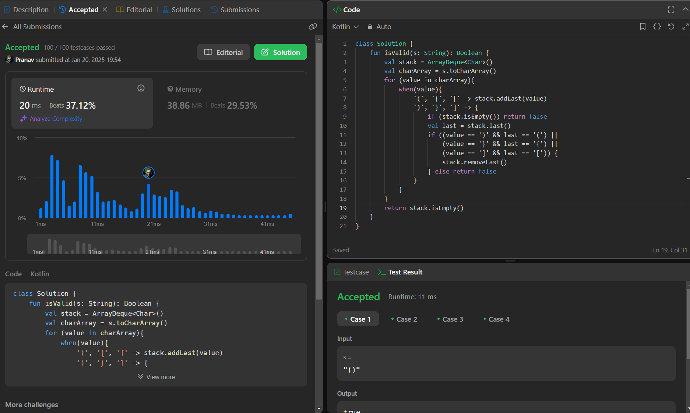

## Day 35: Valid Parentheses

**Problem**: Given a string s containing just the characters '(', ')', '{', '}', '[' and ']', determine if the input string is valid.

**Approach**: 
1. Use a stack: Push opening brackets and pop when matching closing brackets are found.
2. Check mismatches: If a closing bracket doesn’t match the top of the stack, return false.
3. Final check: If the stack is empty at the end, the string is valid; otherwise, it’s not.

**Code**:
```kotlin
class Y_DSA35 {
    fun isValid(s: String): Boolean {
        val stack = ArrayDeque<Char>()
        val charArray = s.toCharArray()
        for (value in charArray){
            when(value){
                '(', '{', '[' -> stack.addLast(value)
                ')', '}', ']' -> {
                    if (stack.isEmpty()) return false
                    val last = stack.last()
                    if ((value == ')' && last == '(') ||
                        (value == '}' && last == '{') ||
                        (value == ']' && last == '[')) {
                        stack.removeLast()
                    } else return false
                }
            }
        }
        return stack.isEmpty()
    }
}

fun main() {
    val str = "([{}])"
    val box = Y_DSA35()
    println(box.isValid(str))
}
```

