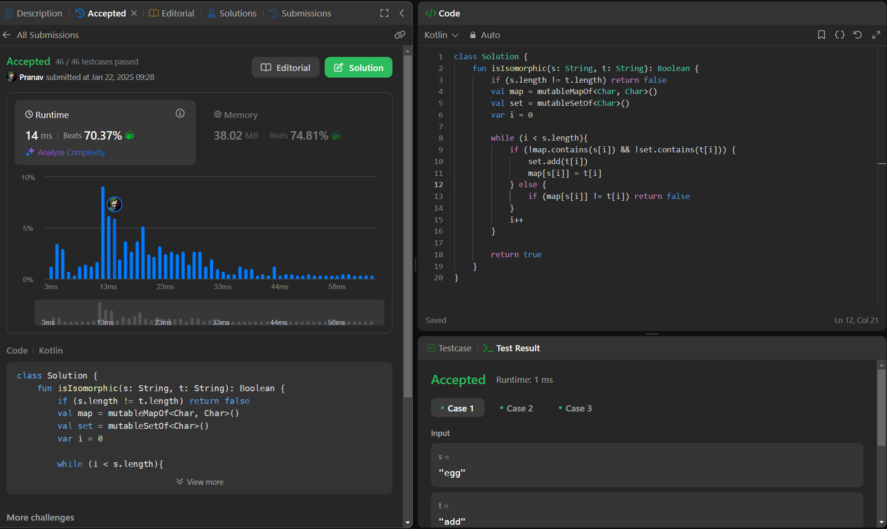

## Day 36: Isomorphic Strings

**Problem**: Given two strings s and t, determine if they are isomorphic.
Two strings s and t are isomorphic if the characters in s can be replaced to get t.

**Approach**: 
1. Check Length: If the lengths of s and t are not equal, return false.
2. Mapping and Validation: Use a map to store character mappings from s to t,and a set to track already mapped characters in t.
3. Traverse Strings: For each character in s and t at the same index:
    - If s[i] is not in the map and t[i] is not in the set, map s[i] to t[i] and add t[i] to the set.
    - If s[i] is in the map but maps to a different character than t[i], return false.
4. Result: If no mismatches are found, return true.

**Code**:
```kotlin
class Y_DSA36 {
    fun isIsomorphic(s: String, t: String): Boolean {
        if (s.length != t.length) return false
        val map = mutableMapOf<Char, Char>()
        val set = mutableSetOf<Char>()
        var i = 0

        while (i < s.length){
            if (!map.contains(s[i]) && !set.contains(t[i])) {
                set.add(t[i])
                map[s[i]] = t[i]
            } else {
                if (map[s[i]] != t[i]) return false
            }
            i++
        }

        return true
    }
}

fun main() {
    val str1 = "badc"
    val str2 = "baba"
    val box = Y_DSA36()
    println(box.isIsomorphic(str1,str2))
}
```

