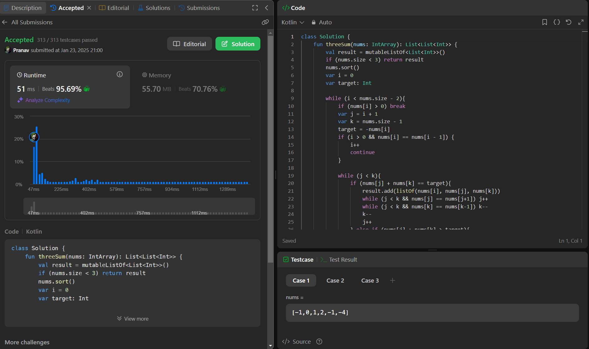

## Day 37: 3Sum

**Problem**: Given an integer array nums, return all the triplets [nums[i], nums[j], nums[k]] such that i != j, i != k, and j != k, and nums[i] + nums[j] + nums[k] == 0.
Notice that the solution set must not contain duplicate triplets.

**Approach**: 
1. Sort the array to help easily skip duplicates and use two pointers efficiently.
2. Iterate through the array with pointer i. For each i, set up two pointers, j (after i) and k (at the end of the array).
3. Calculate the target as -nums[i], so the goal is to find two numbers (nums[j] and nums[k]) that sum up to this target.
4. Move the pointers:
    - If nums[j] + nums[k] == target, a valid triplet is found.
    - Skip duplicates by moving j and k inward when encountering the same values.
    - If the sum is too large, move k left; if it's too small, move j right.
5. Continue until all unique triplets are found.

**Code**:
```kotlin
class Y_DSA37{
    fun threeSum(nums: IntArray): List<List<Int>> {
        val result = mutableListOf<List<Int>>()
        if (nums.size < 3) return result
        nums.sort()
        var i = 0
        var target: Int

        while (i < nums.size - 2){
            if (nums[i] > 0) break
            var j = i + 1
            var k = nums.size - 1
            target = -nums[i]
            if (i > 0 && nums[i] == nums[i - 1]) {
                i++
                continue
            }

            while (j < k){
                if (nums[j] + nums[k] == target){
                    result.add(listOf(nums[i], nums[j], nums[k]))
                    while (j < k && nums[j] == nums[j+1]) j++
                    while (j < k && nums[k] == nums[k-1]) k--
                    k--
                    j++
                } else if (nums[j] + nums[k] > target){
                    k--
                } else j++
            }
            i++
        }
        return result
    }
}

fun main() {
    val array = intArrayOf(0,0,0)
    val box = Y_DSA37()
    println(box.threeSum(array).joinToString(" ") { it.joinToString(", ", "[", "]") })
}
```

