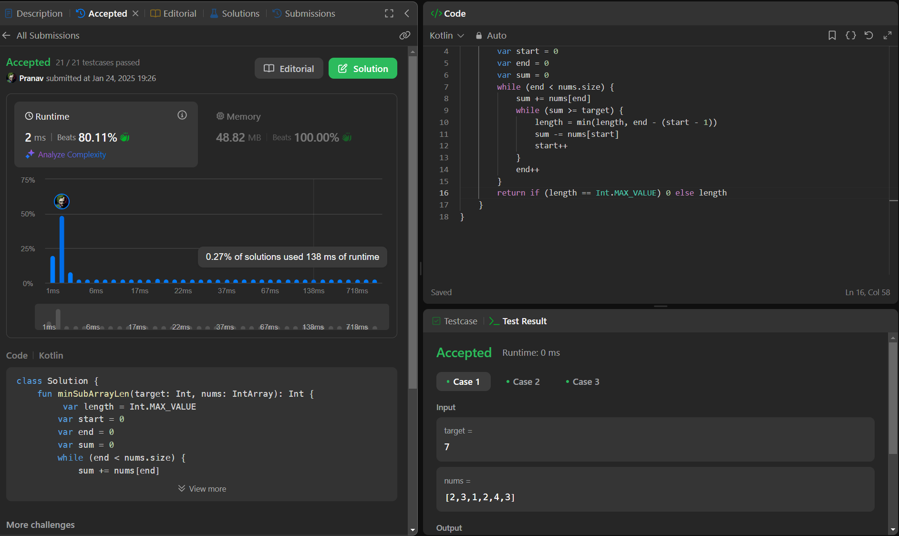

## Day 38: Minimum Size Subarray Sum

**Problem**: Given an array of positive integers nums and a positive integer target, return the minimal length of a 
subarray
 whose sum is greater than or equal to target. If there is no such subarray, return 0 instead.

**Approach**:
- **Used Window Sliding Technique**
1. Use two pointers (start and end) to represent the window.
2. Expand the window by moving end and adding to the sum.
3. Shrink the window by moving start while the sum >= target.
4. Track the minimum window size when the sum is valid.
5. Return the minimum length or 0 if no valid subarray exists.

**Code**:
```kotlin
class Y_DSA38 {
    fun minSubArrayLen(target: Int, nums: IntArray): Int {
        var length = Int.MAX_VALUE
        var start = 0
        var end = 0
        var sum = 0
        while (end < nums.size) {
            sum += nums[end]
            while (sum >= target) {
                length = min(length, end - (start - 1))
                sum -= nums[start]
                start++
            }
            end++
        }
        return if (length == Int.MAX_VALUE) 0 else length
    }
}

fun main() {
    val array = intArrayOf(1,1,1,1,1,1,1,1)
    val box = Y_DSA38()
    println(box.minSubArrayLen(1, array))
}
```

