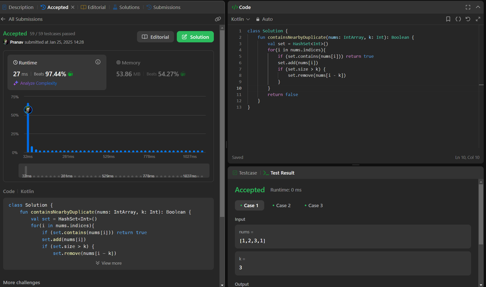

## Day 39: Contains Duplicate II

**Problem**: Given an integer array nums and an integer k, return true if there are two distinct indices i and j in the array such that nums[i] == nums[j] and abs(i - j) <= k.

**Approach**: 
1. Iterate through nums.
2. If set.contains(nums[i]), return true.
3. Add nums[i] to set.
4. If set.size > k, remove nums[i - k] (oldest element).
5. If no duplicates found within k, return false. 

**Code**:
```kotlin
class Y_DSA39 {
    fun containsNearbyDuplicate(nums: IntArray, k: Int): Boolean {
        val set = HashSet<Int>()
        for(i in nums.indices){
            if (set.contains(nums[i])) return true
            set.add(nums[i])
            if (set.size > k) {
                set.remove(nums[i - k])
            }
        }
        return false
    }
}

fun main() {
    val array = intArrayOf(1,2,3,1,2,3)
    val box = Y_DSA39()
    println(box.containsNearbyDuplicate(array, 3))
}
```

