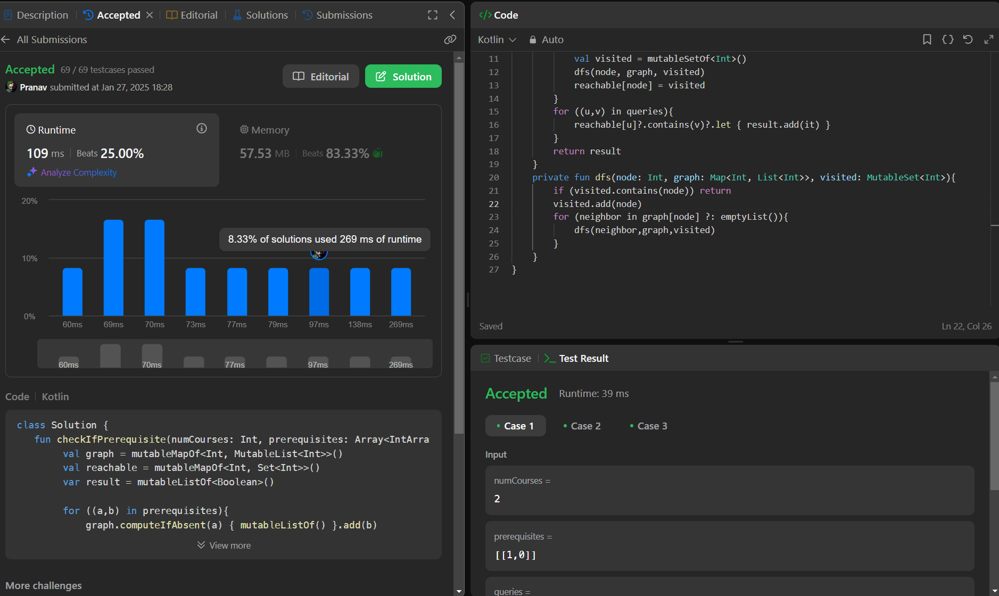

## Day 40: Course Schedule IV

**Problem**: There are a total of numCourses courses you have to take, labeled from 0 to numCourses - 1. You are given an array prerequisites where prerequisites[i] = [ai, bi] indicates that you must take course ai first if you want to take course bi.
For example, the pair [0, 1] indicates that you have to take course 0 before you can take course 1.
Prerequisites can also be indirect. If course a is a prerequisite of course b, and course b is a prerequisite of course c, then course a is a prerequisite of course c.
You are also given an array queries where queries[j] = [uj, vj]. For the jth query, you should answer whether course uj is a prerequisite of course vj or not.
Return a boolean array answer, where answer[j] is the answer to the jth query.

**Approach**: 
1. Graph Construction:
    - Create an adjacency list (graph) where each course points to the courses that depend on it.
    - Use mutableMapOf<Int, MutableList<Int>>() to store prerequisite relationships from prerequisites.

2. Finding Reachability:
    - For each course (from 0 to numCourses - 1), find all courses that can be reached using Depth-First Search (DFS).
    - Use a visited set to track all courses reachable from the current course.
    - Store these results in reachable[node] to avoid redundant computations.

3. Processing Queries:
    - Iterate through each (u, v) query and check if v exists in reachable[u].
    - If v is found in the set, return true; otherwise, return false.

**Code**:
```kotlin
class Y_DSA40 {
    fun checkIfPrerequisite(numCourses: Int, prerequisites: Array<IntArray>, queries: Array<IntArray>): List<Boolean> {
        val graph = mutableMapOf<Int, MutableList<Int>>()
        val reachable = mutableMapOf<Int, Set<Int>>()
        var result = mutableListOf<Boolean>()

        for ((a,b) in prerequisites){
            graph.computeIfAbsent(a) { mutableListOf() }.add(b)
        }
        for (node in 0..<numCourses){
            val visited = mutableSetOf<Int>()
            dfs(node, graph, visited)
            reachable[node] = visited
        }
        for ((u,v) in queries){
            reachable[u]?.contains(v)?.let { result.add(it) }
        }
        return result
    }
    private fun dfs(node: Int, graph: Map<Int, List<Int>>, visited: MutableSet<Int>){
        if (visited.contains(node)) return
        visited.add(node)
        for (neighbor in graph[node] ?: emptyList()){
            dfs(neighbor,graph,visited)
        }
    }

}

fun main() {
    val numCourses = 2
    val prerequisites: Array<IntArray> = arrayOf(
        intArrayOf(1,0)
    )
    val queries = arrayOf(
        intArrayOf(0,1),
        intArrayOf(1,0)
    )
    val box = Y_DSA40()
    println(box.checkIfPrerequisite(numCourses, prerequisites, queries))
}
```

