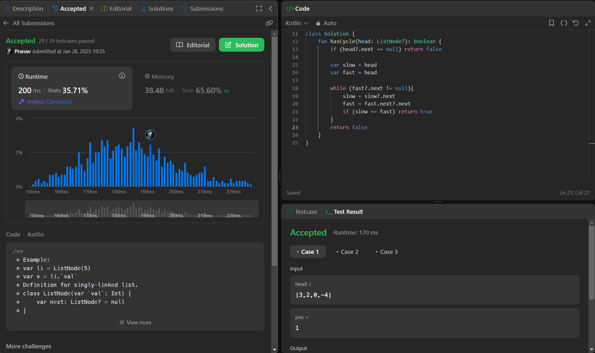

## Day 41: Linked List Cycle

**Problem**: Given head, the head of a linked list, determine if the linked list has a cycle in it.
There is a cycle in a linked list if there is some node in the list that can be reached again by continuously following the next pointer. Internally, pos is used to denote the index of the node that tail's next pointer is connected to. Note that pos is not passed as a parameter.
Return true if there is a cycle in the linked list. Otherwise, return false.

**Approach**: 
1. Initial Checks: If the list is empty or has only one node (head == null or head.next == null), return false because a cycle is impossible.
2. Two Pointers:
    - Use two pointers: slow and fast.
    - slow moves one step at a time, fast moves two steps at a time.
3. Cycle Detection:
    - If slow and fast meet at any point, return true (cycle detected).
    - If fast reaches the end of the list (fast == null or fast.next == null), return false (no cycle).

**Code**:
```kotlin
class ListNode(val value: Int) {
    var next: ListNode? = null
}


class Y_DSA41 {
    fun hasCycle(head: ListNode?): Boolean {
        if (head?.next == null) return false

        var slow = head
        var fast = head

        while (fast?.next != null){
            slow = slow?.next
            fast = fast.next?.next
            if (slow == fast) return true
        }
        return false
    }
}

fun main() {
    val head = ListNode(3)
    val node1 = ListNode(2)
    val node2 = ListNode(0)
    val node3 = ListNode(-4)
    head.next = node1
    node1.next = node2
    node2.next = node3
    node3.next = node1

    val box = Y_DSA41()
    println(box.hasCycle(head = head))
}

```

