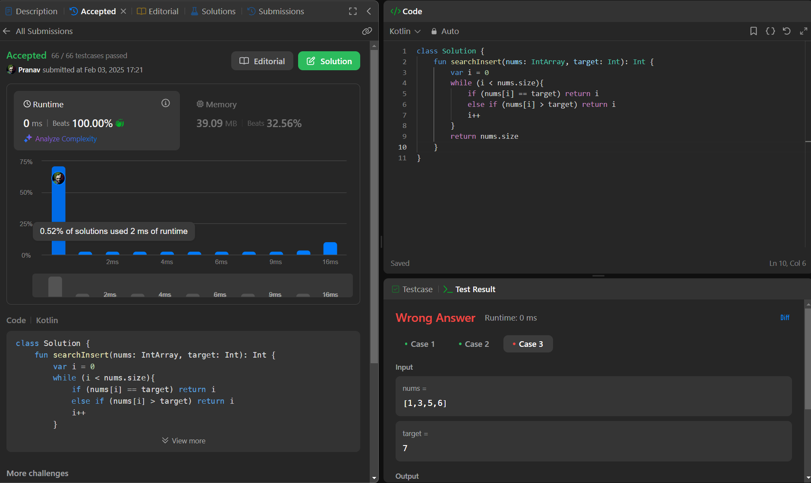

## Day 42: Search Insert Position

**Problem**: Given a sorted array of distinct integers and a target value, return the index if the target is found. If not, return the index where it would be if it were inserted in order.
You must write an algorithm with O(log n) runtime complexity.

**Approach**: 
1. Traverse the Array:
    - Start from the first element and iterate through the array using a loop.
2. Check Conditions:
    - If nums[i] == target, return i because the target is found.
    - If nums[i] > target, return i because the target should be inserted before the current element to maintain the sorted order.
3. If Not Found:
    - If the loop completes without finding a suitable spot, it means the target is larger than all elements.
    - In this case, insert the target at the end of the array, which is index nums.size.

**Code**:
```kotlin
class Y_DSA42 {
    fun searchInsert(nums: IntArray, target: Int): Int {
        var i = 0
        while (i < nums.size){
            if (nums[i] == target) return i
            else if (nums[i] > target) return i
            i++
        }
        return nums.size
    }
}

fun main() {
    val array = intArrayOf(1,3,5,6)
    val box = Y_DSA42()
    println(box.searchInsert(array, 7))
}
```

