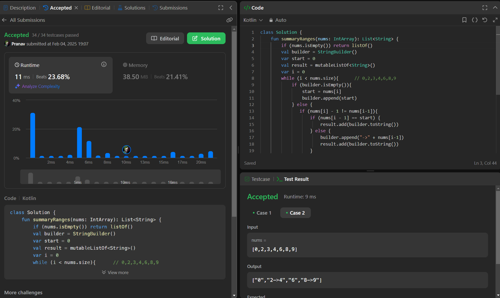

## Day 43: Summary Ranges

**Problem**: You are given a sorted unique integer array nums.
A range [a,b] is the set of all integers from a to b (inclusive).
Return the smallest sorted list of ranges that cover all the numbers in the array exactly. That is, each element of nums is covered by exactly one of the ranges, and there is no integer x such that x is in one of the ranges but not in nums.
- Each range [a,b] in the list should be output as:
    - "a->b" if a != b
    - "a" if a == b 

**Approach**: 
1. initialize Variables:
    - Use a StringBuilder to store the current range.
    - Use start to track the beginning of a range.
    - Use a result list to store final formatted ranges.

2. Iterate Through nums Array:
  - If builder is empty, start a new range.
  - If the current number is not consecutive (nums[i] - 1 != nums[i-1]):
    - If it's a single number, add it directly.
    - If it's a range, append "->" and the last number before breaking the sequence.
    - Clear builder and adjust i to reprocess the breaking element.

3. Handle Last Element Correctly:
If the loop ends but builder contains a number/range, add it to result. Return result.

**Code**:
```kotlin
class Y_DSA43 {
    fun summaryRanges(nums: IntArray): List<String> {
        if (nums.isEmpty()) return listOf()
        val builder = StringBuilder()
        var start = 0
        val result = mutableListOf<String>()
        var i = 0
        while (i < nums.size){      // 0,2,3,4,6,8,9
            if (builder.isEmpty()){
                start = nums[i]
                builder.append(start)
            } else {
               if (nums[i] - 1 != nums[i-1]){
                   if (nums[i - 1] == start) {
                       result.add(builder.toString())
                   } else {
                       builder.append("->" + nums[i-1])
                       result.add(builder.toString())
                   }
                   builder.clear()
                   i--
               } else if (i == nums.size - 1 && builder.isNotEmpty()){
                   builder.append("->" + nums[i])
               }
            }
            i++
        }
        result.add(builder.toString())
        return result
    }
}

fun main() {
    val array = intArrayOf(0,2,3,4,6,8,9)
    val box = Y_DSA43()
    println(box.summaryRanges(array).joinToString(","))
}
```

