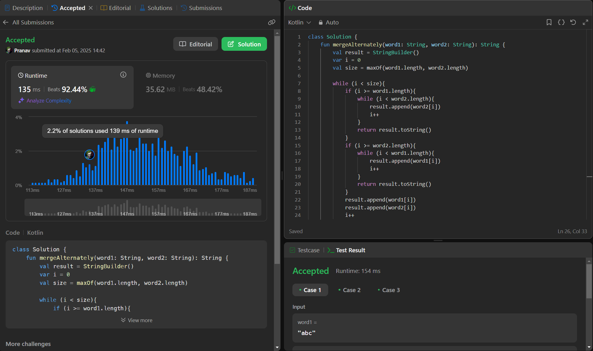

## Day 44: Merge Strings Alternately

**Problem**: You are given two strings word1 and word2. Merge the strings by adding letters in alternating order, starting with word1. If a string is longer than the other, append the additional letters onto the end of the merged string.
Return the merged string.

**Approach**: 
  - Use maxOf(word1.length, word2.length) to determine the loop limit.
  - In each iteration:
    - Append word1[i] if i is within bounds.
    - Append word2[i] if i is within bounds.
  - No need for nested while loops or early return statements.
  - The loop handles both merging and appending leftover character

**Code**:
```kotlin
class Y_DSA44 {
    fun mergeAlternately(word1: String, word2: String): String {
        val result = StringBuilder()
        var i = 0
        val size = maxOf(word1.length, word2.length)

        while (i < size){
            if (i >= word1.length){
                while (i < word2.length){
                    result.append(word2[i])
                    i++
                }
                return result.toString()
            }
            if (i >= word2.length){
                while (i < word1.length){
                    result.append(word1[i])
                    i++
                }
                return result.toString()
            }
            result.append(word1[i])
            result.append(word2[i])
            i++
        }
        return result.toString()
    }
}

fun main() {
    val str1 = "hell"
    val str2 = "kkkkk"
    val box = Y_DSA44()
    println(box.mergeAlternately(str1,str2))
}

```

