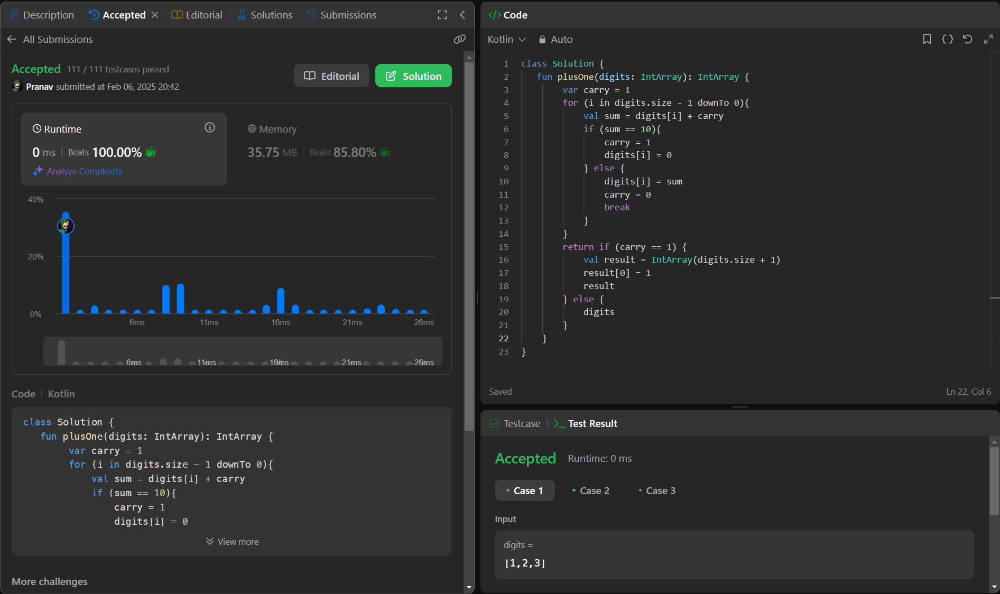

## Day 45: Plus One

**Problem**: You are given a large integer represented as an integer array digits, where each digits[i] is the ith digit of the integer. The digits are ordered from most significant to least significant in left-to-right order. The large integer does not contain any leading 0's.
Increment the large integer by one and return the resulting array of digits.

**Approach**: 
1. Start with carry = 1 (since we're adding one).
2. Loop from the last digit to the first:
    - If digit + carry = 10, set digit to 0, keep carry = 1.
    - Else, add carry, set carry = 0, and stop.
3. If carry is still 1 after the loop, create a new array with an extra 1 at the start.
4. Return the updated array.

**Code**:
```kotlin
class Y_DSA45 {
    fun plusOne(digits: IntArray): IntArray {
        var carry = 1
        for (i in digits.size - 1 downTo 0){
            val sum = digits[i] + carry
            if (sum == 10){
                carry = 1
                digits[i] = 0
            } else {
                digits[i] = sum
                carry = 0
                break
            }
        }
        return if (carry == 1) {
            val result = IntArray(digits.size + 1)
            result[0] = 1
            result
        } else {
            digits
        }
    }
}

fun main() {
    val array = intArrayOf(1,9,9,9)
    val box = Y_DSA45()
    println(box.plusOne(array).joinToString(" "))
}
```

