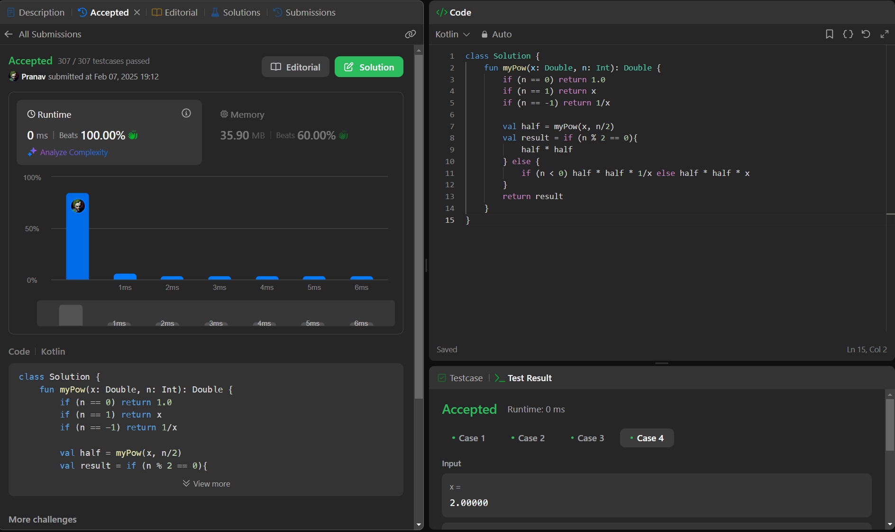

## Day 46: Pow(x, n)

**Problem**: Implement pow(x, n), which calculates x raised to the power n (i.e., xn).
**Approach**: 
1. Base cases:
    - If n == 0, return 1.0 (anything raised to 0 is 1).
    - If n == 1, return x.
    - If n == -1, return 1/x (to handle negative exponents).

2. Recursive Step:
    - Compute half = myPow(x, n/2), which reduces the exponent by half in each step.
    - If n is even → Result is half * half.
    - If n is odd →
      - For positive n, return half * half * x.
      - For negative n, return half * half * 1/x.

**Code**:
```kotlin
class Y_DSA46 {
    fun myPow(x: Double, n: Int): Double {
        if (n == 0) return 1.0
        if (n == 1) return x
        if (n == -1) return 1/x

        val half = myPow(x, n/2)
        val result = if (n % 2 == 0){
            half * half
        } else {
            if (n < 0) half * half * 1/x else half * half * x
        }
        return result
    }
}

fun main() {
    val box = Y_DSA46()
    println(box.myPow(2.0, -4))
}
```

