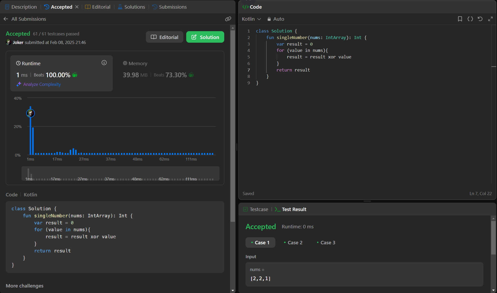

## Day 47: Single Number

**Problem**: Given a non-empty array of integers nums, every element appears twice except for one. Find that single one.
You must implement a solution with a linear runtime complexity and use only constant extra space.

**Approach**:
- Use XOR (^) to cancel out duplicate numbers (a ^ a = 0).
- XOR all elements; only the unique number remains.
- Time: O(n), Space: O(1). 

**Code**:
```kotlin
class Y_DSA47 {
    fun singleNumber(nums: IntArray): Int {
        var result = 0
        for (value in nums){
            result = result xor value
        }
        return result
    }
}

fun main() {
    val array = intArrayOf(4,1,2,1,2)
    val box = Y_DSA47()
    println(box.singleNumber(array))
}
```

