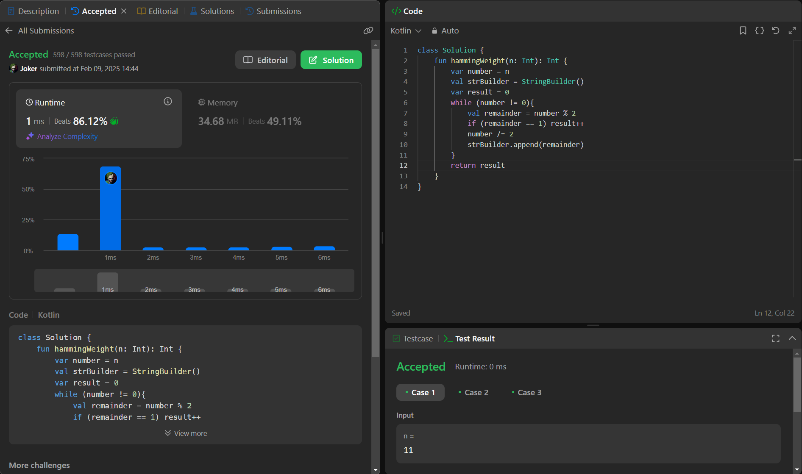

## Day 48: Number of 1 Bits

**Problem**: Given a positive integer n, write a function that returns the number of 
set bits in its binary representation (also known as the Hamming weight).

**Approach**: 
1. Convert n to binary by repeatedly dividing it by 2.
2. Count how many times the remainder is 1 (set bits).
3. Return the count as the Hamming weight.

**Code**:
```kotlin
class Y_DSA48 {
    fun hammingWeight(n: Int): Int {
        var number = n
        val strBuilder = StringBuilder()
        var result = 0
        while (number != 0){
            val remainder = number % 2
            if (remainder == 1) result++
            number /= 2
            strBuilder.append(remainder)
        }
        return result
    }
}

fun main() {
    val box = Y_DSA48()
    print(box.hammingWeight(23))
}
```

