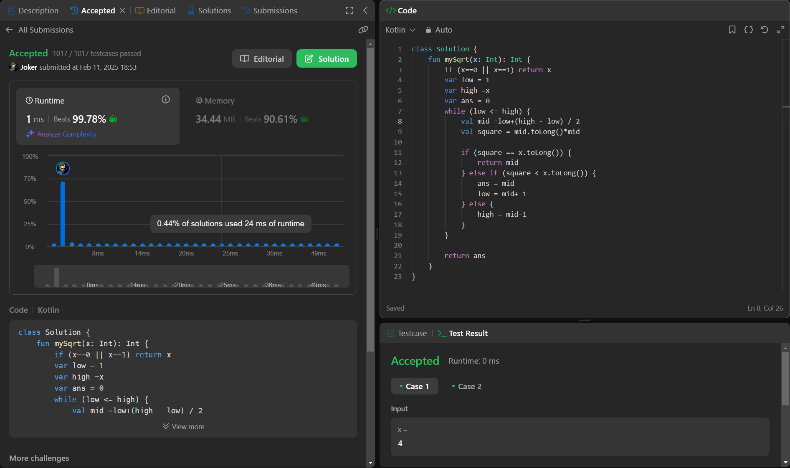

## Day 49: Sqrt(x)

**Problem**: Given a non-negative integer x, return the square root of x rounded down to the nearest integer. The returned integer should be non-negative as well.
You must not use any built-in exponent function or operator.

**Approach**: 
- Set low = 1, high = x.
- While low ≤ high:
    - Compute mid = low + (high - low) / 2.
    - If mid * mid == x, return mid.
    - If mid * mid < x, store mid and move right (low = mid + 1).
    - Else, move left (high = mid - 1).
- Return the stored answer.
**Code**:
```kotlin
class Y_DSA49 {
    fun mySqrt(x: Int): Int {
        if (x==0 || x==1) return x
        var low = 1
        var high =x
        var ans = 0
        while (low <= high) {
            val mid =low+(high - low) / 2
            val square = mid.toLong()*mid

            if (square == x.toLong()) {
                return mid
            } else if (square < x.toLong()) {
                ans = mid
                low = mid+ 1
            } else {
                high = mid-1
            }
        }
        return ans
    }
}

fun main() {
    val box = Y_DSA49()
    print(box.mySqrt(2147395599))
}
```

