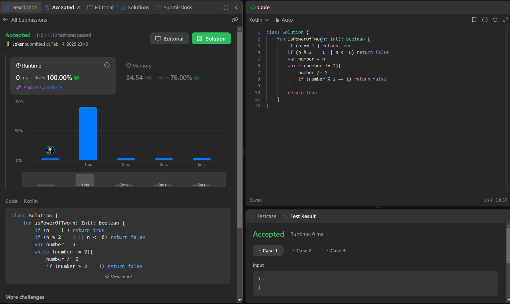

## Day 50: Power of Two

**Problem**: Given an integer n, return true if it is a power of two. Otherwise, return false.
An integer n is a power of two, if there exists an integer x such that n == 2x.

**Approach**:
1. If n == 1, return true. If n <= 0 or odd, return false.
2. Keep dividing n by 2 while it's even.
3. If n becomes exactly 1, return true, else return false.

**Code**:
```kotlin
class Y_DSA50 {
    fun isPowerOfTwo(n: Int): Boolean {
        if (n == 1 ) return true
        if (n % 2 == 1 || n <= 0) return false
        var number = n
        while (number != 2){
            number /= 2
            if (number % 2 == 1) return false
        }
        return true
    }
}

fun main() {
    val box = Y_DSA50()
    println(box.isPowerOfTwo(23))
}
```

