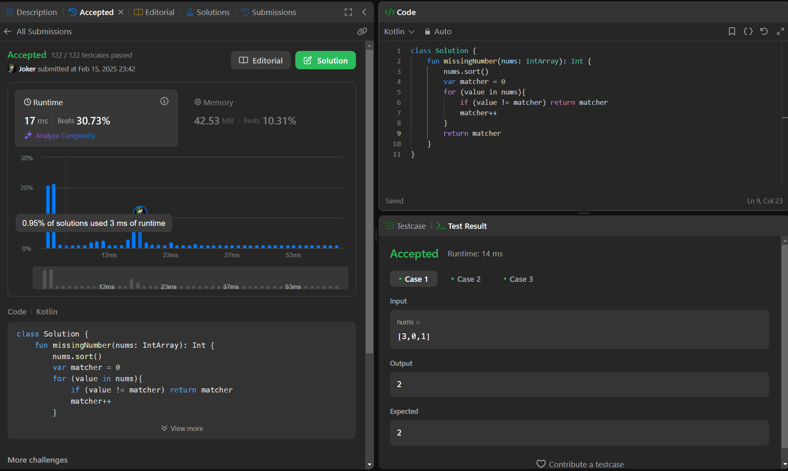

## Day 51: Missing Number

**Problem**: Given an array nums containing n distinct numbers in the range [0, n], return the only number in the range that is missing from the array.

**Approach**: 
1. Sort the array.
2. Use a counter (matcher) starting from 0.
3. Iterate through the array and check if matcher matches the current value.
4. If not, return matcher as the missing number.
5. If all numbers match sequentially, return matcher at the end.

**Code**:
```kotlin
class Y_DSA51 {
    fun missingNumber(nums: IntArray): Int {
        nums.sort()
        var matcher = 0
        for (value in nums){
            if (value != matcher) return matcher
            matcher++
        }
        return matcher
    }
}

fun main() {
    val box = Y_DSA51()
    val array = intArrayOf(3,2,1)

    println(box.missingNumber(array))
}
```

