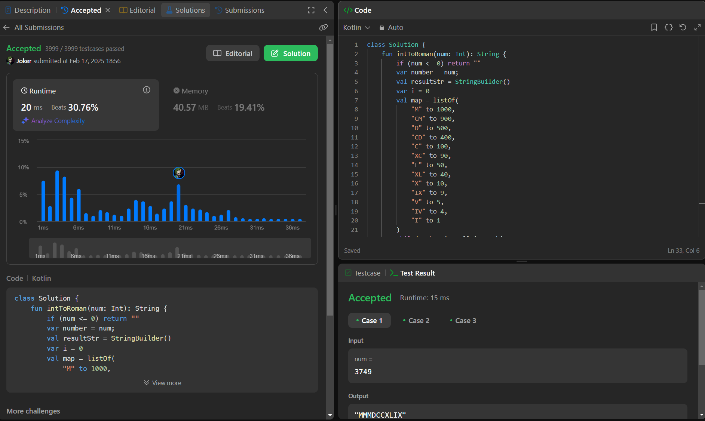

## Day 52: Integer to Roman

**Problem**: Given an integer, convert it to a Roman numeral.
**Approach**: 
1. Initialize a mapping of Roman numeral symbols and their values, including subtractive combinations (e.g., CM for 900).
2. Iterate through the map starting from the largest value, subtracting the Roman value from the number and appending the corresponding symbol to the result.
3. Repeat until the number is reduced to zero.
4. Edge Case: Handle invalid numbers (e.g., negative or zero) by returning an empty string.

**Code**:
```kotlin
class Y_DSA52 {
    fun intToRoman(num: Int): String {
        if (num <= 0) return ""
        var number = num;
        val resultStr = StringBuilder()
        var i = 0
        val map = listOf(
            "M" to 1000,
            "CM" to 900,
            "D" to 500,
            "CD" to 400,
            "C" to 100,
            "XC" to 90,
            "L" to 50,
            "XL" to 40,
            "X" to 10,
            "IX" to 9,
            "V" to 5,
            "IV" to 4,
            "I" to 1
        )
        while(number != 0 && i < 13){
            val (key, value) = map[i]
            number -= value
            if (number >= 0){
                resultStr.append(key)
            } else {
                number += value
                i++
            }
        }
        return resultStr.toString()
    }
}

fun main() {
    val box = Y_DSA52()

    println(box.intToRoman(-10))
}  
```

